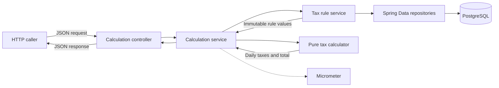

# Architecture

The application is a stateless Spring Boot service. It calculates congestion tax but does not store vehicles, passages, owners, or calculation results.

## Request flow

## Responsibilities

The HTTP adapter validates JSON, maps the request to an application command, and maps the result or error to HTTP.

The calculation service coordinates one complete request. It checks the supported year, loads the selected city and vehicle type, converts local times with the stored city time zone, calls the calculator, and records logs and metrics.

The tax rule service reads one complete tax rule set from PostgreSQL. It validates stored content and maps persistence rows to immutable calculation values.

The pure calculator applies tax exemptions, tax time bands, charge windows, and the daily maximum. It has no dependency on Spring, HTTP, JPA, metrics, or the database.

## Code organization

The main packages follow those responsibilities:

- `calculation.http` owns the HTTP contract.
- `calculation` owns request coordination.
- `taxrule` owns rule loading and validation.
- `taxrule.persistence` owns JPA entities and repositories.
- `domain` owns calculation values and behavior.
- `metrics` owns calculation instrumentation.

Dependencies point toward the domain. Transport and persistence types do not enter the pure calculator.

## City support

The city code selects a stored tax rule set and time zone. The calculation code has no Gothenburg constants. Different time bands, currencies, exemptions, charge windows, and daily maximums can be loaded without a Java change.

The normal runtime database contains Gothenburg. The integration-test database also contains a London fixture with different rules. The fixture proves the boundary but is not runtime data.
