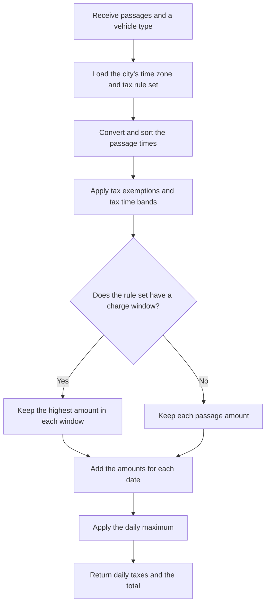

# Calculation

The calculator receives passage times for one vehicle and applies the stored rules for the selected city.

## Calculation flow

The selected city supplies an IANA time zone. The application uses it to convert each local passage time to an instant, then sorts the passages before it calculates the tax. Input order does not change the result.

## Gothenburg rules

The PostgreSQL data for Gothenburg contains these rules:

- Tax time bands cover the full day and use amounts of `0.00`, `8.00`, `13.00`, or `18.00 SEK`. For example, `06:00:00` to `06:30:00` costs `8.00 SEK`, and `07:00:00` to `08:00:00` costs `18.00 SEK`.
- A tax time band includes its start and excludes its end. Thus, `06:29:59` uses the first band and `06:30:00` uses the next band.
- Saturdays, Sundays, public holidays, the date before each public holiday, and all dates in July are tax-free.
- Emergency vehicles, buses, diplomat vehicles, motorcycles, military vehicles, and foreign vehicles are tax-free.
- The charge window is 60 minutes.
- The daily maximum is `60.00 SEK`.

The overnight tax time band starts at `18:30:00`, ends at `06:00:00`, and has a zero amount. The same time-band model can also represent a full day when its start and end are equal.

## Tax exemptions

The calculator checks tax exemptions before it selects a tax time band. A passage is tax-free when its date or vehicle type matches a stored exemption. The response lists the reasons that apply to each date.

A city can store weekday, month, public-holiday, and vehicle-type exemptions. A tax rule option can also make a configured number of dates before each public holiday tax-free. Gothenburg uses one preceding date.

## Charge windows

A charge window groups passages for the single charge rule. The first passage starts the window. A passage exactly 60 minutes later is in the same Gothenburg window, and later passages do not extend it. The highest amount in the window is charged.

A window can cross midnight. An exempt passage or a passage with a zero amount still belongs to its window. If two passages have the same highest amount, the earlier passage wins. The calculator assigns the window amount to the local date of the winning passage.

When a tax rule set has no charge-window option, the calculator charges each passage separately.

## Daily taxes

The calculator adds the selected passage amounts for each local date, then applies the stored daily maximum. It returns one daily tax for every date in the request, including dates with a zero amount, and one total in the rule set's currency.

## Input and failure behavior

Passage times must use the exact `uuuu-MM-dd HH:mm:ss` format and have a date in 2013. The request does not contain a time zone. The application does not add special validation for missing or repeated local times during a daylight-saving-time change. Java resolves them with its standard time-zone rules.

A non-exempt passage must match a tax time band. If it does not, the complete calculation fails. Missing or invalid stored rules also fail the complete calculation. The API returns one error response and never returns a partial result.
