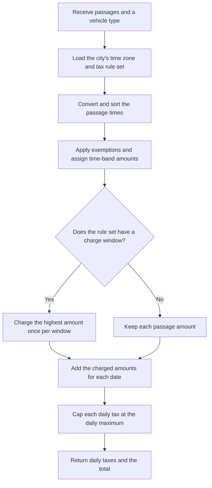

# Calculation

The calculator receives a vehicle type and passage times for one vehicle. It applies the stored rules for the selected city.

A tax rule set is the complete collection of tax rules for one city. A tax time band is one rule in that set. It assigns one tax amount to passages during a period of local time.

## Calculation flow

The selected city supplies an [IANA time zone](https://en.wikipedia.org/wiki/Tz_database). Java uses these identifiers and rules through `ZoneId`. The application converts each local passage time to an instant, then sorts the passages before it calculates the tax. Input order does not change the result.

## Gothenburg rules

The PostgreSQL data for Gothenburg contains these rules:

- Tax time bands cover the full day and use amounts of `0.00`, `8.00`, `13.00`, or `18.00 SEK`. For example, `06:00:00` to `06:30:00` costs `8.00 SEK`, and `07:00:00` to `08:00:00` costs `18.00 SEK`.
- A tax time band includes its start and excludes its end. Thus, `06:29:59` uses the first band and `06:30:00` uses the next band.
- Saturdays, Sundays, public holidays, the date before each public holiday, and all dates in July are tax-free.
- Emergency vehicles, buses, diplomat vehicles, motorcycles, military vehicles, and foreign vehicles are tax-free.
- The charge window is 60 minutes.
- The daily maximum is `60.00 SEK`.

The overnight tax time band starts at `18:30:00`, ends at `06:00:00`, and has a zero amount. The same time-band model can also represent a full day when its start and end are equal.

## Tax exemptions

Each tax rule set has a list of tax exemptions. An exemption makes a passage tax-free when its date or vehicle type matches the exemption. The calculator checks this list before it assigns a time-band amount. The response lists the reasons that apply to each date.

An exemption can specify a weekday, month, public holiday, or vehicle type. The rule set can also specify how many dates before each public holiday are tax-free. The stored rules use one preceding date.

## Charge windows

A charge window is a fixed period in which the calculator charges only the highest applicable amount. For Gothenburg, the first passage starts a 60-minute window. The calculator checks every passage in that window and adds the highest amount to the daily tax once.

A passage exactly 60 minutes after the first passage remains in the same window. The next passage after that starts a new window. Passages inside a window do not extend its end.

A window can cross midnight. An exempt passage or a passage with a zero amount still belongs to its window. If two passages have the same highest amount, the earlier passage wins. The calculator assigns the window amount to the local date of the winning passage.

When a tax rule set has no charge-window option, the calculator charges each passage separately.

## Daily taxes

A daily tax is the amount that one vehicle must pay for one local date. The calculator adds the charged amounts assigned to the date. The daily maximum is a cap on this sum. If the sum exceeds the stored maximum, the daily tax equals the maximum.

The response contains one daily tax for every date in the request, including dates with a zero amount. It also contains the sum of all daily taxes in the rule set's currency.

## Input and failure behavior

Passage times must use the exact `uuuu-MM-dd HH:mm:ss` format and have a date in 2013. The request does not contain a time zone. During a daylight-saving-time change, Java applies the stored time-zone rules without application-specific validation.

A non-exempt passage must match a tax time band. If it does not, the complete calculation fails. Missing or invalid stored rules also fail the complete calculation. The API returns one error response and never returns a partial result.
