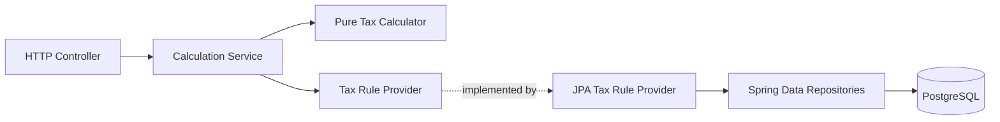

# Application Architecture

This document defines the main application components and the direction of their dependencies.

The application uses stored city data from its first implementation. A city code selects the content for that city. The calculation code does not contain city-specific amounts, time bands, calendar dates, currency, time zone, exemptions, daily maximum, or charge-window duration. The assignment supplies the initial rule data for Gothenburg.



- The HTTP controller validates transport data and creates the HTTP response.
- `CongestionTaxCalculationService` defines the operation that coordinates one complete request.
- `CongestionTaxCalculationServiceImpl` is the Spring `@Service` implementation. It converts time values and calls the other components.
- The pure calculator applies the rules without Spring or database behavior.
- The Tax Rule Provider is the application boundary for city and rule data.
- The JPA provider loads stored rows and maps them to immutable calculation values.
- Spring Data repositories contain explicit database read operations.

The application uses one Maven module with these package areas:

```text
api
application
domain
infrastructure.persistence
```

The Maven group is `io.github.igrgin`, the artifact ID and application name are `congestion-tax-calculator`, and the base Java package is `io.github.igrgin.congestiontax`. The main class is `CongestionTaxCalculatorApplication`.

Dependencies point toward the calculation code. The `domain` area does not depend on Spring, JPA entities, or HTTP models. The `application` area depends on the provider interface, not its JPA implementation. This gives the pure calculator a small public test seam and lets unit tests supply rule data without PostgreSQL.

The provider offers three application operations:

- `findCity(cityCode)` returns the city database ID, public code, and `ZoneId`.
- `findVehicleType(vehicleTypeCode)` confirms that a database-defined Vehicle Type exists and returns its code and description.
- `loadRules(cityId, requiredDates)` returns immutable calculation data indexed by date.

The calculation service first finds the city and Vehicle Type. It then converts passage instants to city-local dates and requests only the rules and calendar data required by those dates. The separate Vehicle Type lookup distinguishes a known taxable type from an unknown code. A taxable type does not appear in the exemption rows, but it must still exist in the Vehicle Type table.

Micrometer instrumentation stays at the Calculation Service boundary. It measures application coordination without adding Micrometer, Spring, or monitoring behavior to the pure calculator. The HTTP and database integrations use the standard meters that Spring Boot supplies.

Every class annotated with Spring `@Service` follows the same naming convention: `XService` is its interface and `XServiceImpl` is its implementation. Consumers inject the interface. This is a project convention. It applies to Spring services, not controllers, Spring Data repositories, configuration classes, the pure calculator, or other components that are not services.
