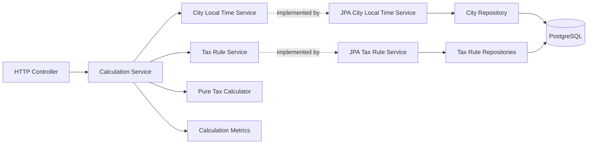

# Application architecture

This document defines the main application components and their dependency directions.

The application uses stored City and Tax Rule data. A city code selects the content for that city. The calculation code does not contain city-specific amounts, Tax Time Bands, currency, or time-zone data.



- The HTTP controller validates transport data, parses Passage timestamps, and creates the HTTP response.
- `CalculationService` defines the operation that coordinates one complete Congestion Tax Calculation.
- `CalculationServiceImpl` calls the City Local Time Service, Tax Rule Service, pure calculator, and metrics component.
- `CityLocalTimeService` loads the selected City and converts Passage instants to City Local Time.
- `TaxRuleService` loads the Vehicle Type and Applicable Tax Rule Sets.
- The pure calculator applies the Tax Rules without Spring, database, HTTP, logging, or metrics behavior.
- The JPA service implementations load stored rows and map them to immutable calculation values.
- Spring Data repositories contain explicit database read operations.
- PostgreSQL constraints protect row validity and stored relationships.

The application uses one Maven module with five owned package areas. HTTP transport stays inside `calculation`. Persistence stays inside the business responsibility that owns the stored data. Metrics use a separate top-level package.

```text
io.github.igrgin.congestiontax
├── calculation
│   ├── exception
│   └── http
│       ├── dto
│       └── exception
├── citylocaltime
│   ├── exception
│   └── persistence
├── domain
│   ├── calculation
│   │   └── exception
│   ├── exception
│   └── rule
│       └── exception
├── metrics
└── taxrule
    ├── exception
    └── persistence
```

The Maven group is `io.github.igrgin`, the artifact ID and application name are `congestion-tax-calculator`, and the base Java package is `io.github.igrgin.congestiontax`. The main class is `CongestionTaxCalculatorApplication`.

## Domain

The `domain` area owns the pure calculation language and behavior. Given a known Vehicle Type, localized Passages, and an Applicable Tax Rule Set for each calculation date, it returns Daily Taxes and a total Tax Amount.

The producer owns collection immutability at each application-area seam. Before a value crosses the seam, its producer creates an unmodifiable collection and does not retain a mutable reference. The receiving record stores the supplied collection without making another copy.

The domain does not:

- find Cities or stored Tax Rules;
- parse HTTP data;
- convert time zones;
- read or write database rows;
- log events;
- record metrics.

`CalculationConfiguration` registers `TaxCalculator` as an explicit Spring bean. `TaxCalculator` has no Spring annotation. This keeps the calculator reusable as a normal Java class.

## Service responsibilities

`CalculationService` coordinates the complete use case. It performs this sequence:

1. Record the calculation timer.
2. Ask `CityLocalTimeService` to load the City and localize the Passages.
3. Ask `TaxRuleService` to load the Vehicle Type.
4. Ask `TaxRuleService` to load the Applicable Tax Rule Sets for the calculation dates.
5. Call `TaxCalculator`.
6. Return the calculated City and calculation result.

`CalculationServiceImpl` translates expected collaborator lookup failures into calculation-owned exceptions after metrics records the outcome. It preserves the lower exception as the cause. This keeps the Calculation module interface independent of its collaborator implementations.

`CityLocalTimeService` owns City lookup and City Local Time conversion. Its implementation and repository are in `citylocaltime.persistence`.

`TaxRuleService` owns Vehicle Type and Tax Rule loading. Its implementation and repositories are in `taxrule.persistence`. One business responsibility can use one repository or several repositories. The service boundary follows the business responsibility, not the number of tables.

Database constraints protect single-row validity and relationships. Repository-facing services check cross-row completeness when they assemble calculation values. The pure calculator checks only the inputs that it needs to calculate safely.

## Dependency directions

Dependencies follow these directions:

```text
calculation.http -> calculation + domain
calculation -> citylocaltime + taxrule + domain + metrics
citylocaltime -> domain
citylocaltime.persistence -> citylocaltime + domain
taxrule -> domain
taxrule.persistence -> taxrule + domain
metrics -> citylocaltime + taxrule
domain -> JDK + compile-time Lombok annotations
```

The domain can use Lombok `@NonNull` as a compile-time annotation. It has no Lombok runtime dependency.

`CalculationServiceImpl` depends on the City Local Time Service and Tax Rule Service interfaces. It does not depend on their persistence implementations or repositories.

Each persistence implementation maps database rows to calculation values and supplies unmodifiable collections before it returns them. Receiving records store these collections without making another copy. JPA entities do not leave their owning persistence package.

## Metrics

Micrometer instrumentation stays at the Calculation Service boundary. It measures application coordination without adding Micrometer, Spring, or monitoring behavior to the pure calculator.

The top-level `metrics` package owns the calculation timer, its metric-name constants, and its bounded outcome values. HTTP and database integrations use the standard meters that Spring Boot supplies.

A metrics failure cannot change the calculation result.

## Logging

Application logging stays at boundaries that know an event's operational outcome. `CalculationServiceImpl` owns calculation start and successful completion. The HTTP exception handler owns expected request rejection and failed HTTP operations. A component that suppresses an internal failure logs it where it catches the failure. Persistence services can log feature decisions at `DEBUG` when the related feature issue requires that detail.

The pure calculator, Domain values, JPA entities, and repositories do not log. One exception or event has one logging owner. A feature issue adds its required context to the owning boundary instead of logging the same event in several layers. `CONTRIBUTING.md` defines the level meanings and safe-data rules.

## Spring service convention

Every class annotated with Spring `@Service` has a matching interface:

```text
XService
XServiceImpl
```

Consumers inject the interface. This convention applies to Spring services. It does not apply to controllers, Spring Data repositories, configuration classes, the pure calculator, or other components that are not services.
