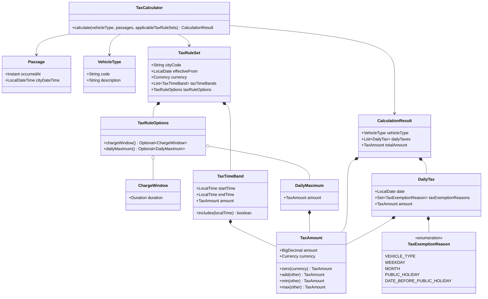

# Calculation Design

This document defines how the application calculates Congestion Tax. The assignment is the source of Congestion Tax behavior.

## Passage time handling

The HTTP API supplies each Passage as City Local Time in `uuuu-MM-dd HH:mm:ss` format. The selected City supplies one stored IANA time zone for all its Passages.

A `Passage` contains:

- the City Local Time supplied by the caller;
- the `Instant` derived with the stored City time zone.

The instant provides chronological order and measures actual elapsed time. City Local Time supplies the calculation date and the local time that selects a Tax Time Band.

The Tax Rule module validates the stored City time zone as an IANA identifier when it loads the City. The Calculation module uses that time zone to create complete Passage values. Missing and repeated local times during daylight-saving changes are outside the supported input contract.

## Calculation flow

The HTTP operation requires one or more Passages. The Passages can use one or more City Local Time dates.

The JSON request contains Passage timestamp strings. A property-specific Jackson content deserializer strictly converts each string to City Local Time before the controller method runs. The controller forwards these `LocalDateTime` values in `CalculationCommand`. `CalculationServiceImpl` collects every index whose City Local Time date is outside 2013 and rejects the complete command when the collection is not empty. This validation occurs before Tax Rule lookup, calculation logs, and custom metrics. This supported Passage year does not limit stored Tax Rule Set or Tax Exemption dates.

The Calculation Service:

1. rejects all unsupported-year indexes in the supplied City Local Times;
2. gets the distinct calculation dates from the City Local Times;
3. asks the Tax Rule Service for the stored City time zone and the Applicable Tax Rule Sets;
4. creates each complete Passage with its City Local Time and derived instant;
5. asks the Tax Rule Service for the Vehicle Type;
6. calls the pure `TaxCalculator`;
7. returns the calculated City and result.

The Tax Calculator:

1. checks that the Passage list is not empty;
2. checks that the Applicable Tax Rule Set map is not empty;
3. checks that the map contains an Applicable Tax Rule Set for each Passage date;
4. groups the Passages by City Local Time date and orders the date groups;
5. orders the Passages in each date group by instant;
6. finds the Tax Time Band amount for each Passage;
7. uses a zero Tax Amount in the Tax Rule Set currency when no band matches;
8. applies the optional Charge Window;
9. applies the optional Daily Maximum;
10. returns one Daily Tax for each input date;
11. adds the Daily Taxes to produce the total Tax Amount.

The Tax Rule Service requires each Applicable Tax Rule Set to contain at least one Tax Time Band. It throws `MissingTaxTimeBandsException` when stored Tax Rules do not meet this requirement.

A Tax Time Band includes its start and excludes its end. For a band from `06:00` to `06:30`:

- `06:00:00` is included;
- `06:29:59` is included;
- `06:30:00` is excluded.

The end of a Tax Time Band must be after its start. One Tax Time Band cannot cross midnight.

## Tax exemptions

`DailyTax` contains a set of `TaxExemptionReason` values. The supported reasons are:

```text
VEHICLE_TYPE
WEEKDAY
MONTH
PUBLIC_HOLIDAY
DATE_BEFORE_PUBLIC_HOLIDAY
```

The current calculation does not apply these Tax Exemptions. It creates each Daily Tax with an empty reason set.

Later issues can apply the stored Tax Exemptions and add every applicable reason to this set. The HTTP response can then explain why a Daily Tax is zero without adding one Boolean field for each Tax Exemption.

## Charge Window and Daily Maximum

When the Applicable Tax Rule Set has no Charge Window, each Passage contributes its Tax Amount to its Daily Tax.

When a Charge Window is present:

1. the first Passage starts the window;
2. the configured duration defines an inclusive boundary from that first Passage instant;
3. later Passages do not move the boundary;
4. the window contributes its highest Tax Amount;
5. the first Passage after the boundary starts the next window.

Zero Tax Amount Passages and repeated Passages participate. A Charge Window uses actual elapsed time between instants. Date grouping prevents a Charge Window from crossing a City Local Time date boundary.

After Charge Window calculation, the optional Daily Maximum limits the Daily Tax. When the Applicable Tax Rule Set has no Daily Maximum, the calculated daily amount is unchanged.

Later issues will apply Vehicle Type, weekday, month, public-holiday, and pre-holiday Tax Exemptions.

## Java calculation model



`TaxAmount` contains a `BigDecimal` and a Java `Currency`. Its constructor rejects null values and negative amounts. Its `add`, `min`, and `max` operations reject Tax Amounts that use different currencies.

Collection-owning calculation values receive unmodifiable collections from their producers. They store the supplied collections without making another copy.

`TaxTimeBand` rejects null values, an end time that is equal to or before its start time, and a non-positive Tax Amount.

`TaxRuleSet` rejects null fields and requires at least one Tax Time Band. Its Tax Rule Options can contain one Charge Window and one Daily Maximum.

The calculator has no Spring annotations, repository calls, database calls, system-clock access, logging, or metrics. The same inputs produce the same result.
