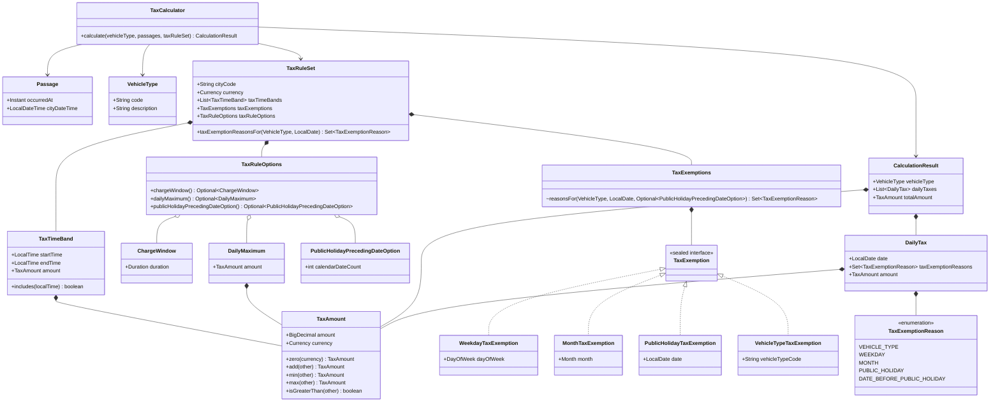

# Calculation Design

This document defines how the application calculates Congestion Tax. The assignment is the source of Congestion Tax behavior.

## Passage time handling

The HTTP API supplies each Passage as City Local Time in `uuuu-MM-dd HH:mm:ss` format. The selected City supplies one stored IANA time zone for all its Passages.

A `Passage` contains:

- the City Local Time supplied by the caller;
- the `Instant` derived with the stored City time zone.

The instant provides chronological order and measures actual elapsed time. City Local Time supplies the calculation date and the local time that selects a Tax Time Band.

The Tax Rule module validates the stored City time zone as an IANA identifier when it loads the City. The Calculation module uses that time zone to create complete Passage values. Missing and repeated local times during daylight-saving changes are outside the supported input contract.

## Calculation flow

The HTTP operation requires one or more Passages. The Passages can use one or more City Local Time dates.

The JSON request contains Passage timestamp strings. A property-specific Jackson content deserializer strictly converts each string to City Local Time before the controller method runs. The controller forwards these `LocalDateTime` values in `CalculationCommand`. `CalculationServiceImpl` collects every index whose City Local Time date is outside 2013 and rejects the complete command when the collection is not empty. This validation occurs before Tax Rule lookup, calculation logs, and custom metrics. This supported Passage year does not limit stored Tax Exemption dates.

The Calculation Service:

1. rejects all unsupported-year indexes in the supplied City Local Times;
2. asks the Tax Rule Service for the stored City time zone and Tax Rule Set;
3. creates each complete Passage with its City Local Time and derived instant;
4. asks the Tax Rule Service for the Vehicle Type;
5. calls the pure `TaxCalculator`;
6. writes one `DEBUG` event for each exempt Daily Tax;
7. returns the calculated City and result.

The Tax Calculator:

1. checks that the Passage list is not empty;
2. orders all Passages by instant;
3. applies stored Tax Exemptions to each Passage;
4. finds the Tax Time Band amount for each non-exempt Passage;
5. uses a zero Tax Amount in the Tax Rule Set currency when no band matches;
6. applies the optional Charge Window across the ordered Passage list;
7. assigns each window charge to one City Local Time date;
8. adds the assigned charges for each input date;
9. applies the optional Daily Maximum to each date;
10. returns one Daily Tax for each input date in date order;
11. adds the Daily Taxes to produce the total Tax Amount.

The Tax Rule Service requires the City's Tax Rule Set to contain at least one Tax Time Band. It throws `MissingTaxTimeBandsException` when stored Tax Rules do not meet this requirement.

A Tax Time Band includes its start and excludes its end. For a band from `06:00` to `06:30`:

- `06:00:00` is included;
- `06:29:59` is included;
- `06:30:00` is excluded.

An end time after the start time defines a same-date band. An end time before the start time defines one band that crosses midnight. For a cross-midnight band, the local time matches when it is on or after the start or before the end. Equal start and end times define a full-day band, and every local time matches it.

Tax Time Bands can have positive or zero Tax Amounts. Gaps are valid and produce a zero Tax Amount in the Tax Rule Set currency. Tax Time Bands must not overlap when the service compares them around the complete 24-hour clock. This rule rejects nested bands, such as `06:00–09:00` with `07:00–08:00`. It also means that a full-day band must be the only band in its Tax Rule Set and cannot coexist with another full-day band.

The Tax Rule Service stops at the first conflicting pair and throws `OverlappingTaxTimeBandsException`. Same-date, cross-midnight, nested, and full-day conflicts use this one exception because they violate the same overlap rule.

## Tax exemptions

`DailyTax` contains a set of `TaxExemptionReason` values. The supported reasons are:

```text
VEHICLE_TYPE
WEEKDAY
MONTH
PUBLIC_HOLIDAY
DATE_BEFORE_PUBLIC_HOLIDAY
```

Before Tax Time Band selection, the calculator gets all matching reasons from the City's Tax Rule Set for the selected Vehicle Type and each Passage City Local Time date. An exempt Passage has a zero Tax Amount and still participates in its Charge Window. Each Daily Tax reports all reasons that apply to its date and Vehicle Type. The HTTP response can explain why the Daily Tax is zero without one Boolean field for each Tax Exemption.

## Charge Window and Daily Maximum

When the Tax Rule Set has no Charge Window, each Passage contributes its Tax Amount to its City Local Time date.

When a Charge Window is present:

1. the first Passage starts the window;
2. the configured duration defines an inclusive boundary from that first Passage instant;
3. later Passages do not move the boundary;
4. the window contributes its highest Tax Amount;
5. when several Passages have the highest amount, the earliest one wins;
6. the charge belongs to the winning Passage's City Local Time date;
7. the first Passage after the boundary starts the next window.

Zero Tax Amount Passages, exempt Passages, and repeated Passages participate. A Charge Window uses actual elapsed time between instants and can cross a City Local Time date boundary. Midnight does not end or restart the window.

Each distinct input date produces one Daily Tax. A date can have a zero amount because its Passage lost a cross-date Charge Window. That result has no Tax Exemption Reason unless a Tax Exemption also applies to the date.

After the calculator assigns and adds Charge Window charges by date, the optional Daily Maximum limits each Daily Tax. When the Tax Rule Set has no Daily Maximum, the calculated daily amount is unchanged.

## Java calculation model



`TaxAmount` contains a `BigDecimal` and a Java `Currency`. Its constructor rejects null values and negative amounts. Its arithmetic and comparison operations reject Tax Amounts that use different currencies.

Collection-owning calculation values receive unmodifiable collections from their producers. They store the supplied collections without making another copy.

`TaxTimeBand` rejects null values. `TaxAmount` rejects negative amounts before they can enter a Tax Time Band. `TaxTimeBand` interprets an end before the start as a cross-midnight band and equal start and end times as a full-day band.

`TaxExemptions` contains the four sealed Tax Exemption values. It rejects null and duplicate values. `VehicleTypeTaxExemption` also rejects a blank Vehicle Type code. The centralized matcher returns reasons for a matching Vehicle Type, weekday, month, or public holiday. A Public Holiday Preceding-Date Option extends only stored public-holiday Tax Exemptions. It has no effect when the Tax Rule Set has no public-holiday Tax Exemption.

`TaxRuleSet` rejects null fields and requires at least one Tax Time Band. Its Tax Rule Options can contain one Charge Window, one Daily Maximum, and one Public Holiday Preceding-Date Option. The Public Holiday Preceding-Date Option requires a positive calendar-date count.

The calculator uses this centralized matcher for Tax Exemptions. It does not copy the matching rules into the calculation flow.

The calculator has no Spring annotations, repository calls, database calls, system-clock access, logging, or metrics. The same inputs produce the same result.
