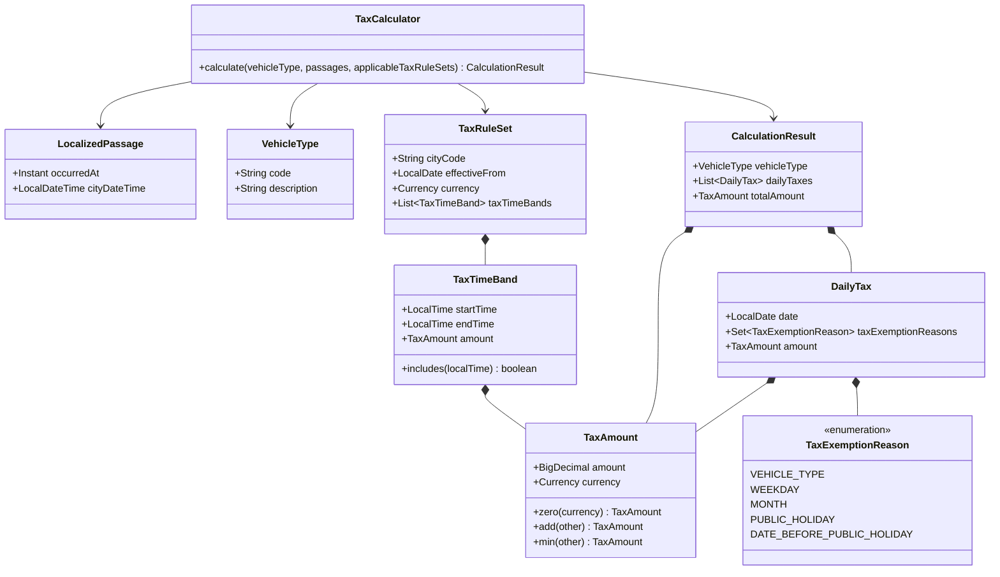

# Calculation Design

This document defines how the application calculates Congestion Tax. The assignment is the source of Congestion Tax behavior.

## Passage time handling

The HTTP API supplies each Passage as an ISO 8601 timestamp with `Z` or an explicit UTC offset. The timestamp identifies one instant. The controller converts it to a Java `Instant`.

The City Local Time Service uses the stored IANA time zone for the selected City to create a `LocalizedPassage`. A `LocalizedPassage` contains:

- the original `Instant`;
- the corresponding City Local Time.

The instant provides chronological order and measures actual elapsed time. City Local Time supplies the calculation date and the local time that selects a Tax Time Band.

An input offset does not have to equal the offset of the selected City. The input offset identifies the instant. The stored City time zone determines the City Local Time.

The offset-free assignment values are a test-data exception. Test data interprets them as Gothenburg local times in `Europe/Stockholm` and converts them to instants.

## One-Passage calculation

The current HTTP operation requires exactly one Passage. The controller enforces this limit before it calls the Calculation Service.

The Calculation Service:

1. asks the City Local Time Service to localize the Passage;
2. asks the Tax Rule Service for the Vehicle Type;
3. asks the Tax Rule Service for the Applicable Tax Rule Set for the calculation date;
4. calls the pure `TaxCalculator`;
5. returns the calculated City and result.

The Tax Calculator:

1. checks that the Passage list is not empty;
2. checks that the Applicable Tax Rule Set map is not empty;
3. checks that the map contains an Applicable Tax Rule Set for the Passage date;
4. gets the Applicable Tax Rule Set for the Passage date;
5. finds the Tax Time Band that contains the Passage local time;
6. uses the Tax Amount from the matching band;
7. uses a zero Tax Amount in the Tax Rule Set currency when no band matches;
8. returns one Daily Tax and the same amount as the total Tax Amount.

The Tax Rule Service requires each Applicable Tax Rule Set to contain at least one Tax Time Band. It throws `MissingTaxTimeBandsException` when stored Tax Rules do not meet this requirement.

A Tax Time Band includes its start and excludes its end. For a band from `06:00` to `06:30`:

- `06:00:00` is included;
- `06:29:59` is included;
- `06:30:00` is excluded.

The end of a Tax Time Band must be after its start. One Tax Time Band cannot cross midnight.

## Tax exemptions

`DailyTax` contains a set of `TaxExemptionReason` values. The supported reasons are:

```text
VEHICLE_TYPE
WEEKDAY
MONTH
PUBLIC_HOLIDAY
DATE_BEFORE_PUBLIC_HOLIDAY
```

The current one-Passage calculation does not apply these Tax Exemptions. It creates a Daily Tax with an empty reason set.

Later issues can apply the stored Tax Exemptions and add every applicable reason to this set. The HTTP response can then explain why a Daily Tax is zero without adding one Boolean field for each Tax Exemption.

## Later calculation behavior

Later issues will extend the calculator with the remaining assignment behavior:

1. Sort Passages by instant and group them by City Local Time date.
2. Select the Applicable Tax Rule Set for each date.
3. Apply Vehicle Type, weekday, month, public-holiday, and pre-holiday Tax Exemptions.
4. Calculate the Tax Amount for each taxable Passage.
5. Apply the Charge Window rule.
6. Apply the Daily Tax limit.
7. Return one Daily Tax for each input date.
8. Add the Daily Taxes to produce the total Tax Amount.

A Charge Window does not slide forward when a later Passage occurs. It starts with its first Passage and uses actual elapsed time between instants. It cannot cross a City Local Time date boundary.

## Java calculation model



`TaxAmount` contains a `BigDecimal` and a Java `Currency`. Its constructor rejects null values and negative amounts. Its `add` and `min` operations reject Tax Amounts that use different currencies.

Collection-owning calculation values receive unmodifiable collections from their producers. They store the supplied collections without making another copy.

`TaxTimeBand` rejects null values, an end time that is equal to or before its start time, and a non-positive Tax Amount.

`TaxRuleSet` rejects null fields and requires at least one Tax Time Band.

The calculator has no Spring annotations, repository calls, database calls, system-clock access, logging, or metrics. The same inputs produce the same result.
