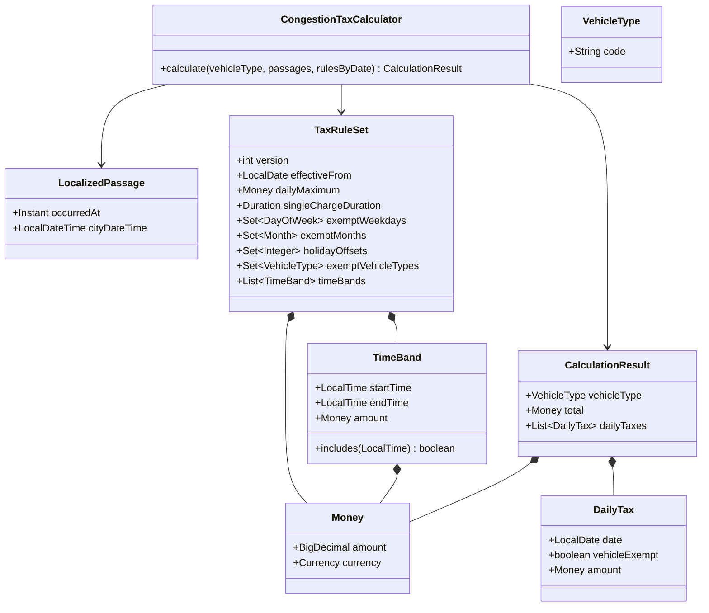

# Calculation Design

This document defines how the application calculates congestion tax. The assignment is the only source of congestion-tax behavior.

## Passage Time Handling

The HTTP API supplies each passage as an ISO 8601 timestamp with `Z` or an explicit UTC offset. The timestamp identifies one instant. The application converts it to a Java `Instant`, then uses the selected city's IANA time zone to produce city local time.

The instant provides chronological order and measures actual elapsed minutes. City local time supplies the calendar date, weekday, month, public-holiday checks, and time-band match. Keeping both values avoids errors when a local clock changes for daylight-saving time.

Input offsets can differ within one request and do not have to equal the city's offset. A city stores an IANA time-zone identifier, not a fixed offset.

The offset-free assignment values are a test-data exception. The test fixture interprets them as Gothenburg local times in `Europe/Stockholm`, then converts them to instants.

## Supported Year

The application supports city-local dates in 2013 only. It checks the year after time-zone conversion. If any passage is outside 2013, the complete request fails. It does not return a partial result.

## Calculation Order

For one vehicle, the application:

1. Converts each passage instant to city local time.
2. Rejects passages outside the supported year.
3. Sorts passages by instant and groups them by city-local date.
4. Selects the applicable stored rules for each date.
5. Produces zero tax when the Vehicle Type is exempt for that date.
6. Produces zero tax on an exempt weekday, exempt month, public holiday, or configured date relative to a holiday.
7. Finds the time-band amount for each remaining passage. No matching positive band means zero.
8. Starts a charge window with the first passage. It includes later passages no more than the configured number of actual minutes after that first passage.
9. Charges only the highest passage amount in each window.
10. Adds the window amounts and applies the daily maximum.
11. Returns one Daily Tax for each input date and the sum of all Daily Taxes.

A window does not slide forward when a later passage arrives. Every passage, including a zero-amount passage, participates and can start a window. Repeated timestamps are accepted and follow the same rule. A window cannot cross a city-local calendar-date boundary.

Time-band starts are inclusive and ends are exclusive. Thus, `06:29:59` is in the band that ends at `06:30`, and `06:30:00` is in the next band.

## Java Calculation Model

`Money` contains `BigDecimal` and Java `Currency`. It prevents arithmetic between different currencies. The calculator has no Spring annotations, repository calls, database calls, or access to the system clock. The same inputs always produce the same result.
