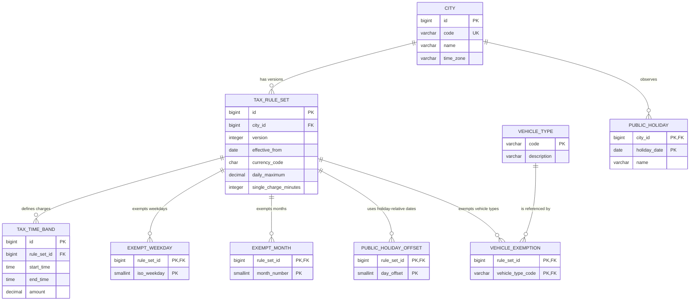

# Persistence Design

This document defines how PostgreSQL stores city rules and how Spring Data JPA loads them. Tax rules are external runtime content. The completed application has no silent in-memory fallback when PostgreSQL is unavailable.

## Database Relationships



`CITY` stores the API code, display name, and IANA time-zone identifier. `TAX_RULE_SET` stores an immutable version, its effective date, currency, daily maximum, and single-charge duration. A city cannot have two rows with the same version or effective date.

`EXEMPT_WEEKDAY` and `EXEMPT_MONTH` store the tax-free weekdays and months. `PUBLIC_HOLIDAY_OFFSET` stores dates relative to a public holiday: `0` means the holiday and `-1` means the preceding date. `PUBLIC_HOLIDAY` stores named dates observed by a city. It can contain an adjacent-year date needed to calculate a 2013 exemption.

`VEHICLE_TYPE` stores every known code and description. The initial codes are `OTHER`, `EMERGENCY`, `BUS`, `DIPLOMAT`, `MOTORCYCLE`, `MILITARY`, and `FOREIGN`. A code has the same meaning in every city. `VEHICLE_EXEMPTION` lets each stored rule version independently decide which known types are exempt. A known type that is not listed for a city is taxable. This avoids conflicting definitions while retaining city control.

All relationships use restrictive foreign keys. There is no `ON DELETE CASCADE`, because an automatic deletion could remove historical content.

## Effective Versions

There is no status column. The assignment does not require a draft or publication workflow. Every stored rule set is an immutable effective version. For a calculation date, the provider selects the version for that city with the latest `effective_from` value that is not after the date. A newer version ends the preceding version's effective period but does not delete it.

If a city has no applicable version, or stored content is inconsistent, the provider reports invalid server configuration. It never selects the newest version silently for an unsupported date.

## Time Bands

Each positive-charge band stores:

```text
start_time TIME
end_time TIME
amount NUMERIC(12,2)
```

The rule-set currency applies to the amount. No matching row means zero tax. The amount must be greater than zero because the database stores only positive-charge bands.

- End later than start: the band is within one date.
- End earlier than start: the band crosses midnight.
- End equal to start: the band covers the full 24-hour day.
- Start is inclusive and end is exclusive.
- Midnight is `00:00`; the database does not use `24:00`.

The loader rejects overlapping positive bands. A full-day band cannot coexist with another positive band in one rule set.

Rejected representations were integer minute numbers, an `ends_next_day` flag, and start time plus duration. Two SQL `TIME` values remain readable to content editors, map to Java `LocalTime`, and need no consistency flag or calculated end.

## JPA Loading

Flyway owns the schema and the initial rule data supplied by the assignment. Hibernate uses `ddl-auto=validate`; it checks mappings but does not create or change tables.

The JPA entity for a rule set has no `@OneToMany` child collections. Each child entity refers to its parent rule-set ID. The provider explicitly bulk-loads child rows for the required IDs. This makes database reads visible and avoids one large join that repeats parent data.

`loadRules` uses a method-level `@Transactional(readOnly = true)` boundary. It calls the required repositories inside one transaction, then maps the rows to immutable values before it returns. There is no cascade-based write workflow.

Use Spring Data method-name queries for simple reads and JPQL when it expresses a bulk read more clearly. Use handwritten PostgreSQL SQL only for a measured performance need or a PostgreSQL-specific feature.

PostgreSQL constraints enforce single-row validity, keys, and relationships. Flyway seed checks and provider checks reject cross-row errors such as overlapping time bands. A database exclusion constraint is future work if rule editing becomes part of the application.

## Initial Calendar Data

Flyway stores the verified Swedish public holiday dates needed for 2013 calculations. It also stores 1 January 2014 because 31 December 2013 is the day immediately before that holiday. The README identifies the calendar source. This calendar data does not add tax behavior that is absent from the assignment.

The initial calendar contains these named public holidays:

| Date | Name |
|---|---|
| 2013-01-01 | New Year's Day |
| 2013-01-06 | Epiphany |
| 2013-03-29 | Good Friday |
| 2013-03-31 | Easter Sunday |
| 2013-04-01 | Easter Monday |
| 2013-05-01 | May Day |
| 2013-05-09 | Ascension Day |
| 2013-05-19 | Pentecost Sunday |
| 2013-06-06 | National Day |
| 2013-06-22 | Midsummer Day |
| 2013-11-02 | All Saints' Day |
| 2013-12-25 | Christmas Day |
| 2013-12-26 | Second Day of Christmas |
| 2014-01-01 | New Year's Day |

## Initial Assignment Rule Data

Flyway inserts one city with code `gothenburg`, name `Gothenburg`, and time zone `Europe/Stockholm`. Rule version 1 starts on 1 January 2013. It uses currency `SEK`, a daily maximum of `60.00`, and a single-charge period of 60 minutes.

It inserts these positive-charge time bands:

| Start | End | Amount in SEK |
|---|---|---:|
| 06:00 | 06:30 | 8.00 |
| 06:30 | 07:00 | 13.00 |
| 07:00 | 08:00 | 18.00 |
| 08:00 | 08:30 | 13.00 |
| 08:30 | 15:00 | 8.00 |
| 15:00 | 15:30 | 13.00 |
| 15:30 | 17:00 | 18.00 |
| 17:00 | 18:00 | 13.00 |
| 18:00 | 18:30 | 8.00 |

No matching positive-charge band produces zero tax. The rule exempts ISO weekdays 6 and 7, which are Saturday and Sunday. It exempts month 7, which is July. Public-holiday offsets `0` and `-1` exempt each public holiday and its immediately preceding date.

The initial Vehicle Type codes are `OTHER`, `EMERGENCY`, `BUS`, `DIPLOMAT`, `MOTORCYCLE`, `MILITARY`, and `FOREIGN`. The rule exempts all of these codes except `OTHER`.
