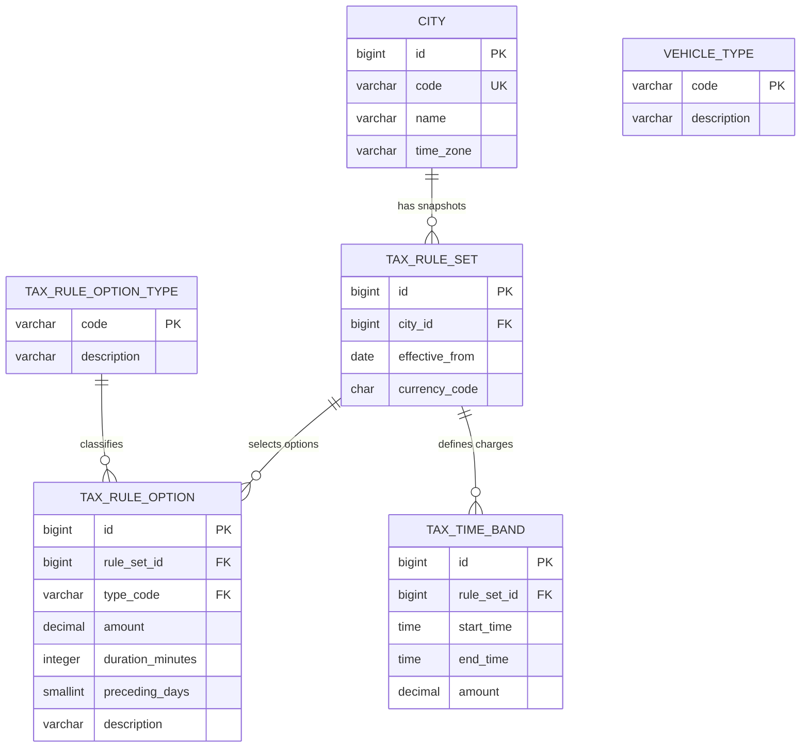

# Persistence Design

This document defines how PostgreSQL stores City and Tax Rule data and how Spring Data JPA loads it. Stored data is runtime content. The application has no in-memory fallback when PostgreSQL is unavailable.

## Current database schema



`CITY` stores the API code, display name, and required IANA time-zone identifier. The identifier uses the same region format as `Europe/Stockholm`. A fixed offset such as `+01:00` is invalid.

`VEHICLE_TYPE` stores each known Vehicle Type code and description. A Vehicle Type has one meaning across all Cities.

`TAX_RULE_SET` stores one immutable Tax Rule snapshot for one City. It contains the effective date and the currency for every Tax Amount in the set. A City cannot have two Tax Rule Sets with the same effective date.

`TAX_TIME_BAND` stores the local start time, local end time, and positive amount for one Tax Rule Set. The Tax Rule Set supplies the currency.

`TAX_RULE_OPTION_TYPE` contains these code-owned values:

```text
DAILY_MAXIMUM
CHARGE_WINDOW
HOLIDAY_PRECEDING
```

`TAX_RULE_OPTION` can store one selected scalar value for each option type in a Tax Rule Set. Database checks require each row to use the correct value column:

- `DAILY_MAXIMUM` uses `amount`;
- `CHARGE_WINDOW` uses `duration_minutes`;
- `HOLIDAY_PRECEDING` uses `preceding_days`.

The Tax Rule Service loads `CHARGE_WINDOW` and `DAILY_MAXIMUM` rows. It maps them to typed, immutable Domain values. An absent row disables only the matching behavior. `HOLIDAY_PRECEDING` remains stored content for the Tax Exemption issue.

All foreign keys use restrictive deletion. The schema does not use `ON DELETE CASCADE` because automatic deletion could remove historical Tax Rule content.

## Applicable Tax Rule Sets

The schema does not use an active or status column. For one calculation date, the Applicable Tax Rule Set is the set for the selected City with the latest `effective_from` date that is not after the calculation date.

`TaxRuleServiceImpl` loads candidates up to the latest requested calculation date. It then selects the Applicable Tax Rule Set for each calculation date.

If no Applicable Tax Rule Set exists, the service throws `MissingApplicableTaxRuleSetException`. It does not select a future Tax Rule Set or silently use rules from another City.

A newer Tax Rule Set ends the effective period of the preceding set. It does not delete or modify the preceding set.

A Tax Rule Set does not inherit child rows from a preceding set. A future publication workflow must create a complete new snapshot with all unchanged and changed Tax Rules.

## Tax Time Bands

Each Tax Time Band stores:

```text
start_time TIME WITHOUT TIME ZONE
end_time TIME WITHOUT TIME ZONE
amount NUMERIC(12,2)
```

A Tax Time Band follows these rules:

- the start is included;
- the end is excluded;
- the end must be after the start;
- the band cannot cross midnight;
- the amount must be positive;
- the same Tax Rule Set cannot contain an exact duplicate start and end pair.

The database enforces rules for one row. `TaxRuleServiceImpl` enforces rules that require the complete collection:

- an Applicable Tax Rule Set must contain at least one Tax Time Band;
- Tax Time Bands in one set must not overlap.

Adjacent bands are valid. For example, `06:00–06:30` and `06:30–07:00` do not overlap.

Gaps are valid. If no Tax Time Band contains a Passage local time, the calculator returns a zero Tax Amount in the Tax Rule Set currency.

The service sorts a copy of the loaded bands by start time for overlap validation. It does not depend on repository result order.

## JPA loading

Flyway owns the schema and stored seed data. Hibernate uses `ddl-auto=validate`. Hibernate checks the entity mappings but does not create or change database objects.

The Tax Rule Service uses:

```text
taxrule.TaxRuleServiceImpl
taxrule.persistence.CityRepository
taxrule.persistence.VehicleTypeRepository
taxrule.persistence.TaxRuleSetRepository
taxrule.persistence.TaxTimeBandRepository
taxrule.persistence.TaxRuleOptionRepository
taxrule.persistence.CityEntity
taxrule.persistence.VehicleTypeEntity
taxrule.persistence.TaxRuleSetEntity
taxrule.persistence.TaxTimeBandEntity
taxrule.persistence.TaxRuleOptionEntity
```

It loads the selected City, validates its stored time zone with the JDK IANA time-zone data, and loads the Vehicle Type, Applicable Tax Rule Sets, Tax Time Bands, and Tax Rule Options. An invalid stored City time zone is a stored-content failure.

The Tax Rule Set entity does not contain a JPA child collection. `TaxTimeBandEntity` and `TaxRuleOptionEntity` store their parent ID as a scalar field. The service loads the selected parent rows. It then uses one bulk read for the required Tax Time Bands and one bulk read for the required Tax Rule Options.

`TaxRuleOptions` owns an unmodifiable collection of typed Domain options. It rejects duplicate option types. Its `chargeWindow()` and `dailyMaximum()` queries return an empty result when the stored row is absent. `ChargeWindow` owns a positive `Duration`. `DailyMaximum` owns a positive `TaxAmount` in the Tax Rule Set currency.

This makes database reads explicit and avoids a large join that repeats parent data. PostgreSQL foreign keys enforce the stored relationships.

Each service method uses a read-only transaction. The service maps database rows to calculation values and creates unmodifiable collections before it returns. The receiving records store these collections without making another copy. Persistence types can be public for use by `TaxRuleServiceImpl`, but the service never returns them through `TaxRuleService`.

Use Spring Data method-name queries for simple reads. Use JPQL when it expresses a bulk or snapshot query more clearly. Use handwritten PostgreSQL SQL only when a PostgreSQL-specific feature, a measured performance need, or an entity-ownership boundary makes JPQL unsuitable. Cover native queries with PostgreSQL integration tests.

## Database and service validation

PostgreSQL constraints protect:

- primary and foreign keys;
- required columns;
- unique City codes;
- non-blank City time zones;
- unique City and effective-date pairs;
- three-letter upper-case currency codes;
- positive Tax Amounts;
- Tax Time Band order;
- exact duplicate Tax Time Bands;
- valid Tax Rule Option value shapes;
- one Tax Rule Option of each type in a Tax Rule Set.

Repository-facing services protect cross-row completeness when they assemble calculation values. The current Tax Rule Service checks for:

- invalid stored City time zones;
- invalid or duplicate stored Tax Rule Options;
- missing Applicable Tax Rule Sets;
- missing Tax Time Bands;
- overlapping Tax Time Bands;
- unknown Cities;
- unknown Vehicle Types.

These failures are stored-content or lookup failures. The pure calculator does not repeat database validation.

## Current seed data

Flyway inserts the minimum stored content for the one-Passage calculation:

```text
City code: gothenburg
City name: Gothenburg
City time zone: Europe/Stockholm
Vehicle Type: OTHER
Tax Rule Set effective from: 2013-01-01
Currency: SEK
Tax Time Band: 06:00–06:30
Tax Amount: 8.00 SEK
```

This data supports the issue acceptance path:

```text
Passage: 2013-02-08 06:20:27
    -> 06:00–06:30 Tax Time Band
    -> 8.00 SEK
```

The current seed does not contain Tax Rule Options. Tests use synthetic option rows. A later migration will add the complete Gothenburg Tax Rule Options with the remaining Vehicle Types, Tax Time Bands, and Tax Exemption data.

During development, later Flyway migrations can complete the initial assignment seed before the first release. After release, runtime content workflows must treat each published Tax Rule Set as immutable.
