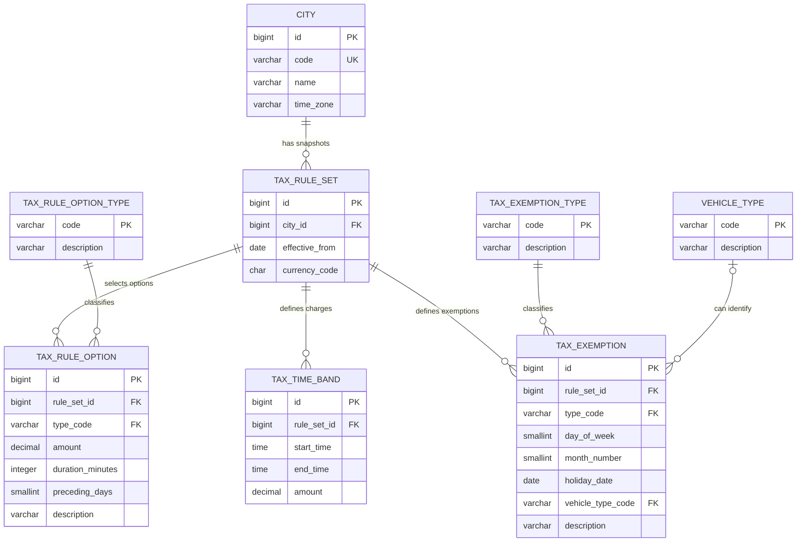

# Persistence Design

This document defines how PostgreSQL stores city rules and how Spring Data JPA loads them. Tax rules are external runtime content. The completed application has no silent in-memory fallback when PostgreSQL is unavailable.

## Database Relationships



`CITY` stores the API code, display name, and IANA time-zone identifier. `TAX_RULE_SET` stores one immutable, complete snapshot of the rules. It contains its effective date and currency. A city cannot have two Tax Rule Sets with the same effective date. There is no separate version number.

`TAX_RULE_OPTION_TYPE` contains the code-owned values `DAILY_MAXIMUM`, `CHARGE_WINDOW`, and `HOLIDAY_PRECEDING`. Flyway installs this reference data. Content editors can select the values but cannot add a new type of calculation behavior. The Java `TaxRuleOptionType` enum uses the same codes.

`TAX_RULE_OPTION` stores optional scalar Tax Rules owned by one Tax Rule Set. Each row uses exactly one value column:

- `DAILY_MAXIMUM` uses a positive `amount`. An absent row means that Daily Tax has no maximum.
- `CHARGE_WINDOW` uses a positive `duration_minutes`. An absent row means that each taxable Passage produces its own charge.
- `HOLIDAY_PRECEDING` uses positive `preceding_days`. An absent row means that no date before a public holiday is tax-free.

The other two value columns must be null. The optional description makes stored content readable and does not affect calculation. A unique constraint on `rule_set_id` and `type_code` permits at most one option of each type in a Tax Rule Set.

`TAX_EXEMPTION_TYPE` contains the code-owned values `WEEKDAY`, `MONTH`, `PUBLIC_HOLIDAY`, and `VEHICLE_TYPE`. Flyway installs this reference data. Content editors can select the values but cannot add a new type of calculation behavior. The Java `TaxExemptionType` enum uses the same codes.

`TAX_EXEMPTION` stores all tax-free content owned by one Tax Rule Set. Each row uses exactly one value column:

- `WEEKDAY` uses `day_of_week`, from 1 for Monday through 7 for Sunday.
- `MONTH` uses `month_number`, from 1 through 12.
- `PUBLIC_HOLIDAY` uses `holiday_date`.
- `VEHICLE_TYPE` uses `vehicle_type_code`.

The other three value columns must be null. The optional description makes stored content readable and does not affect calculation. Partial unique indexes prevent a Tax Rule Set from containing the same Tax Exemption twice.

A Tax Rule Set can contain no Tax Exemptions. In that case, no stored weekday, month, public-holiday date, or known Vehicle Type is tax-free. A `HOLIDAY_PRECEDING` Tax Rule Option requires at least one `PUBLIC_HOLIDAY` Tax Exemption.

`VEHICLE_TYPE` stores every known code and description. The initial codes are `OTHER`, `EMERGENCY`, `BUS`, `DIPLOMAT`, `MOTORCYCLE`, `MILITARY`, and `FOREIGN`. A code has the same meaning in every city. A known type without a matching `VEHICLE_TYPE` Tax Exemption is taxable. This keeps unknown-type validation separate from exemption selection.

All relationships use restrictive foreign keys. There is no `ON DELETE CASCADE`, because an automatic deletion could remove historical content.

## Effective Snapshots

There is no active or status column. The assignment does not require a draft or publication workflow. Every stored Tax Rule Set is an immutable, complete snapshot. For a calculation date, the provider selects the Applicable Tax Rule Set for that city. It has the latest `effective_from` value that is not after the date. A newer set ends the preceding set's effective period but does not delete it.

A Tax Rule Set does not inherit content from the preceding set. The future content publication workflow starts from the Tax Rule Set that is applicable immediately before the new effective date. It copies every unchanged Tax Rule Option, Tax Time Band, and Tax Exemption, then applies all additions, replacements, and removals. An absent child row does not apply during the newer period. The database does not copy rows with a trigger, and the calculation application does not merge snapshots at runtime.

One database transaction inserts a complete Tax Rule Set and all its child rows. PostgreSQL makes the snapshot visible only when the transaction commits. A complete future Tax Rule Set can be stored before its effective date, and date-based selection ignores it until that date.

The base tables permit historical effective dates because Flyway installs the existing 2013 Gothenburg content. A future editor publication workflow requires `effective_from` to be no earlier than the next City Local Date. Only Flyway or another controlled administrative process can import historical content. The first delivery has no editor interface or draft workflow.

If a city has no Applicable Tax Rule Set, or stored content is inconsistent, the provider reports invalid server configuration. It never selects the newest snapshot silently for an unsupported date.

## Time Bands

Each positive-charge band stores:

```text
start_time TIME
end_time TIME
amount NUMERIC(12,2)
```

The rule-set currency applies to the amount. No matching row means zero tax. The amount must be greater than zero because the database stores only positive-charge bands.

- End later than start: the band is within one date.
- End earlier than start: the band crosses midnight.
- End equal to start: the band covers the full 24-hour day.
- Start is inclusive and end is exclusive.
- Midnight is `00:00`; the database does not use `24:00`.

The loader requires at least one positive Tax Time Band and rejects overlapping positive bands. A full-day band cannot coexist with another positive band in one rule set. Gaps between positive bands are valid and produce zero tax.

The provider rejects a Tax Rule Set with no positive Tax Time Bands. Such a set can never produce a positive Daily Tax and is invalid stored content.

Rejected representations were integer minute numbers, an `ends_next_day` flag, and start time plus duration. Two SQL `TIME` values remain readable to content editors, map to Java `LocalTime`, and need no consistency flag or calculated end.

## JPA Loading

Flyway owns the schema and the initial rule data supplied by the assignment. Hibernate uses `ddl-auto=validate`; it checks mappings but does not create or change tables.

The JPA entity for a Tax Rule Set has no child collections. Each Tax Rule Option, Tax Time Band, and Tax Exemption entity refers to its parent Tax Rule Set ID. The provider explicitly bulk-loads the required child rows for the required IDs. This makes database reads visible and avoids one large join that repeats parent data.

Map these parent IDs as scalar fields. Add a JPA association only when application code needs entity navigation, an association fetch plan, or cascade behavior. PostgreSQL foreign keys enforce the stored relationships. The supporting research is in [`docs/research/jpa-scalar-foreign-key-guidance.md`](../research/jpa-scalar-foreign-key-guidance.md).

The Tax Rule Option and Tax Exemption entities map their `type_code` values to Java enums as strings. The provider validates each type-specific value. It maps Tax Rule Options to explicit Daily Tax limit, Passage charging, and holiday-preceding values. It maps Tax Exemptions to typed calculation collections. The calculation model does not depend on type codes or nullable persistence values.

`loadRules` uses a method-level `@Transactional(readOnly = true)` boundary. It calls the required repositories inside one transaction, then maps the rows to immutable values before it returns. There is no cascade-based write workflow.

Use Spring Data method-name queries for simple reads and JPQL when it expresses a bulk read more clearly. Use handwritten PostgreSQL SQL only for a measured performance need or a PostgreSQL-specific feature.

PostgreSQL constraints enforce single-row validity, keys, relationships, valid type-specific value combinations, and duplicate prevention. Flyway seed checks and provider checks reject cross-row errors such as overlapping time bands. The provider also rejects a `HOLIDAY_PRECEDING` Tax Rule Option when the Tax Rule Set has no public-holiday Tax Exemptions. A database exclusion constraint is future work if rule editing becomes part of the application.

## Initial Public-Holiday Exemptions

Flyway stores each verified Swedish public holiday as a `PUBLIC_HOLIDAY` Tax Exemption in the Gothenburg Tax Rule Set. It also stores 1 January 2014 because 31 December 2013 is the date immediately before that holiday. The README identifies the calendar source. The adjacent date supports the 2013 calculation limit and does not add another year of calculation support.

The initial calendar contains these named public holidays:

| Date | Name |
|---|---|
| 2013-01-01 | New Year's Day |
| 2013-01-06 | Epiphany |
| 2013-03-29 | Good Friday |
| 2013-03-31 | Easter Sunday |
| 2013-04-01 | Easter Monday |
| 2013-05-01 | May Day |
| 2013-05-09 | Ascension Day |
| 2013-05-19 | Pentecost Sunday |
| 2013-06-06 | National Day |
| 2013-06-22 | Midsummer Day |
| 2013-11-02 | All Saints' Day |
| 2013-12-25 | Christmas Day |
| 2013-12-26 | Second Day of Christmas |
| 2014-01-01 | New Year's Day |

## Initial Assignment Rule Data

Flyway inserts one city with code `gothenburg`, name `Gothenburg`, and time zone `Europe/Stockholm`. Its first Tax Rule Set starts on 1 January 2013 and uses currency `SEK`. A `DAILY_MAXIMUM` Tax Rule Option has an amount of `60.00`. A `CHARGE_WINDOW` option has a duration of 60 minutes. A `HOLIDAY_PRECEDING` option has one preceding day.

It inserts these positive-charge time bands:

| Start | End | Amount in SEK |
|---|---|---:|
| 06:00 | 06:30 | 8.00 |
| 06:30 | 07:00 | 13.00 |
| 07:00 | 08:00 | 18.00 |
| 08:00 | 08:30 | 13.00 |
| 08:30 | 15:00 | 8.00 |
| 15:00 | 15:30 | 13.00 |
| 15:30 | 17:00 | 18.00 |
| 17:00 | 18:00 | 13.00 |
| 18:00 | 18:30 | 8.00 |

No matching positive-charge band produces zero tax. `WEEKDAY` Tax Exemptions use day-of-week values 6 and 7, which are Saturday and Sunday. A `MONTH` Tax Exemption uses month 7, which is July. Each listed holiday date is a `PUBLIC_HOLIDAY` Tax Exemption. The `HOLIDAY_PRECEDING` Tax Rule Option makes the immediately preceding date tax-free.

The initial Vehicle Type codes are `OTHER`, `EMERGENCY`, `BUS`, `DIPLOMAT`, `MOTORCYCLE`, `MILITARY`, and `FOREIGN`. `VEHICLE_TYPE` Tax Exemptions select all of these codes except `OTHER`.
