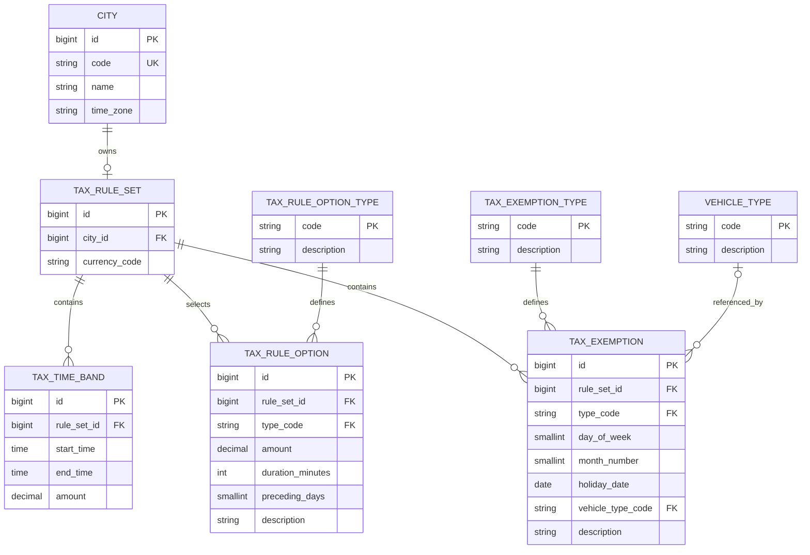

# Persistence

PostgreSQL stores the city and tax-rule content used at runtime. The application has no in-memory rule fallback.

## Data model

| Table | Purpose |
|---|---|
| `city` | Stores the city code, name, and IANA time zone. |
| `vehicle_type` | Stores the known vehicle categories. |
| `tax_rule_set` | Connects one city to one rule set and currency. |
| `tax_time_band` | Stores a local start time, end time, and amount. |
| `tax_rule_option` | Stores optional values for charge windows, daily maximums, and dates before public holidays. |
| `tax_exemption` | Stores weekday, month, public-holiday, and vehicle-type exemptions. |
| Type tables | Limit option and exemption rows to behavior supported by the Java application. |

A city can have at most one tax rule set. The database permits a rule set with no tax time bands, but the application rejects it as incomplete when it loads it. The model does not keep effective dates or historical rule versions.

## Flyway and PostgreSQL

Flyway creates the schema and loads the initial content. Hibernate uses `ddl-auto=validate`, so it checks mapped objects but does not create or update database objects.

PostgreSQL constraints protect required values, unique codes, foreign keys, valid option shapes, and valid exemption shapes. A PostgreSQL exclusion constraint prevents overlapping tax time bands for one rule set. It also supports bands that cross midnight and a single full-day band.

The migrations contain the complete runtime data for Gothenburg. [Calculation](calculation.md) describes the implemented rules.

Flyway SQL handles schema creation, seed content, check constraints, and the time-band exclusion constraint. PostgreSQL integration tests verify this behavior because Hibernate validation does not cover the complete schema.

## JPA, entities, and repositories

Spring Data JPA repositories read cities, vehicle types, tax rule sets, tax time bands, tax rule options, and tax exemptions. Hibernate maps one entity to each of these tables. The option-type and exemption-type tables constrain the supported codes in PostgreSQL and do not need JPA entities.

The entities store foreign-key identifiers as scalar fields. Repositories perform explicit reads, and the tax rule service maps the rows to immutable calculation values inside read-only transactions. Most repositories use Spring Data method queries. `TaxRuleSetRepository` uses one native SQL join through JPA to find a rule set by city code.

JPA and Hibernate were selected instead of `JdbcTemplate` because standard repository operations and entity mapping cover this small read model. The entities do not use `@ManyToOne`, `@OneToMany`, or `@ManyToMany` associations because the application does not need entity navigation, cascades, or association fetch plans. This keeps each database read explicit.

## Other cities

To add another city, add a city row with its time zone and a tax rule set with its currency. Add at least one tax time band. Tax rule options and exemptions are optional and must use the supported types. This does not require a Java or schema change unless the city needs a new type of option or exemption.
