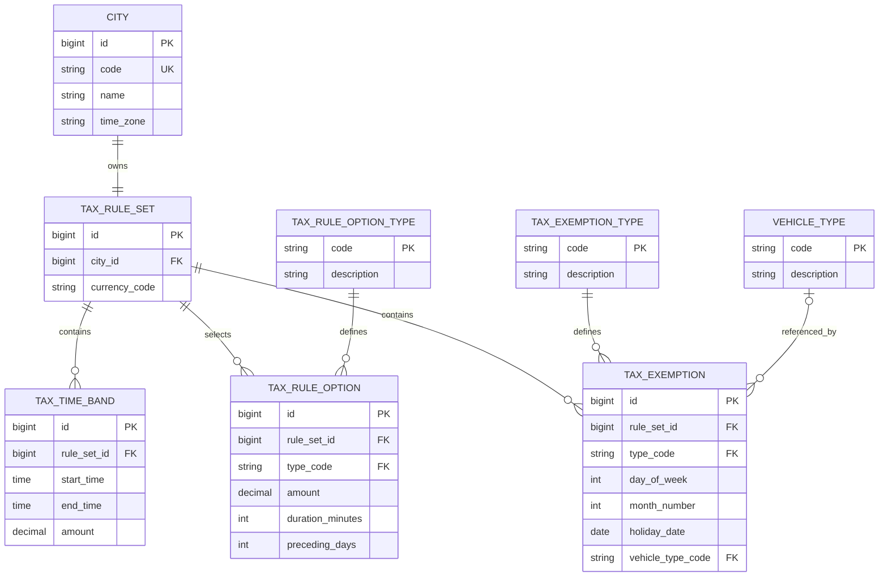

# Persistence

PostgreSQL stores the city and tax-rule content used at runtime. The application has no in-memory rule fallback.

## Data model

| Table | Purpose |
|---|---|
| `city` | Stores the city code, name, and IANA time zone. |
| `vehicle_type` | Stores the known vehicle categories. |
| `tax_rule_set` | Connects one city to one rule set and currency. |
| `tax_time_band` | Stores a local start time, end time, and amount. |
| `tax_rule_option` | Stores optional values for charge windows, daily maximums, and dates before public holidays. |
| `tax_exemption` | Stores weekday, month, public-holiday, and vehicle-type exemptions. |
| Type tables | Limit option and exemption rows to behavior supported by the Java application. |

Each city has one tax rule set. The model does not keep effective dates or historical rule versions.

## Flyway and PostgreSQL

Flyway creates the schema and loads the initial content. Hibernate uses `ddl-auto=validate`, so it checks mapped objects but does not create or update database objects.

PostgreSQL constraints protect required values, unique codes, foreign keys, valid option shapes, and valid exemption shapes. A PostgreSQL exclusion constraint prevents overlapping tax time bands for one rule set. It also supports bands that cross midnight and a single full-day band.

The migrations contain the complete Gothenburg data. This includes ten time bands, the `Europe/Stockholm` time zone, SEK, the 60-minute charge window, the `60.00 SEK` daily maximum, calendar exemptions, and vehicle-type exemptions.

## JPA loading

Spring Data JPA and Hibernate handle the small read-only persistence model. They were selected instead of `JdbcTemplate` because generated repository operations and entity mapping cover most of the required reads with less custom mapping code. Repository methods load the selected city, vehicle type, rule set, time bands, options, and exemptions. The tax rule service maps those rows to immutable domain values inside read-only transactions.

The entities store foreign-key identifiers as scalar fields. They do not use `@ManyToOne`, `@OneToMany`, or `@ManyToMany` associations. The service controls every read, and no entity association can start an implicit fetch or cascade. PostgreSQL foreign keys remain the source of relational integrity.

This model also avoids entity graphs that the calculation does not need. A tax exemption is an explicit row with its own type and values, not a many-to-many link hidden behind two entity collections.

Most repositories use Spring Data method queries. `TaxRuleSetRepository` uses one native SQL join to find a rule set by city code because the entities do not contain a navigable city association. Spring Data JPA still executes that query and maps its result.

Flyway SQL handles database-specific work, including schema creation, seed content, check constraints, and the time-band exclusion constraint. PostgreSQL integration tests verify this behavior because Hibernate validation does not cover the complete schema.

## Other cities

Adding another city needs stored city and rule rows, not a change to the calculator. Different cities can use different currencies, time bands, exemptions, charge-window durations, and daily maximums. A rule option can also be absent.

The `london-test` city exists only in a test migration. It uses GBP, different time bands, a Monday exemption, no charge window, and a different daily maximum.
