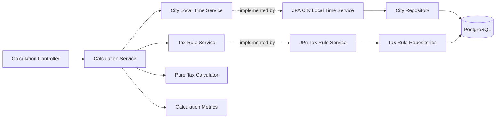

# Issue 3: Calculate One Passage from Stored Tax Rules

## Purpose

Issue 3 adds the first complete Congestion Tax Calculation path.

One HTTP request:

1. selects a City;
2. supplies one known Vehicle Type and one offset Passage;
3. converts the Passage instant to City Local Time;
4. loads the Applicable Tax Rule Set from PostgreSQL;
5. calculates one Daily Tax;
6. returns the result;
7. records the calculation timer;
8. writes the first application log events at their owning boundaries.

Read `CONTEXT.md`, `CONTRIBUTING.md`, and `docs/design/README.md` before changing this implementation.

## Scope

This issue implements:

- the final collection-based HTTP request shape;
- exactly one Passage for the current operation;
- Passage parsing with `Z` or an explicit UTC offset;
- City lookup and City Local Time conversion;
- Vehicle Type lookup;
- effective-date Tax Rule Set selection;
- Tax Time Band loading and validation;
- one-Passage Tax calculation;
- the final Daily Tax Exemption Reason response shape;
- a bounded Calculation Service timer;
- safe parameterized `DEBUG`, `INFO`, `WARN`, and `ERROR` events;
- separate production controls for root and application-package logging;
- the PostgreSQL schema and minimum seed data;
- focused and full-path tests.

Later issues add:

- multiple Passages;
- Charge Windows;
- Daily Tax limits;
- complete supported-year validation;
- several calculation dates;
- Tax Exemptions;
- complete Gothenburg Tax Rules;
- complete Problem Details and OpenAPI behavior;
- alternate-City coverage.

The current seed is pre-release staged content. It supports this vertical path but does not contain the complete Gothenburg Tax Rule snapshot.

## Required result

Use this request:

```http
POST /api/v1/cities/gothenburg/congestion-tax/calculations
Content-Type: application/json

{
  "vehicleType": "OTHER",
  "passages": [
    "2013-02-08T05:20:27Z"
  ]
}
```

The Passage instant is `2013-02-08T06:20:27` in the stored `Europe/Stockholm` time zone. It matches the stored `06:00–06:30` Tax Time Band.

Return:

```json
{
  "cityCode": "gothenburg",
  "vehicleType": "OTHER",
  "currency": "SEK",
  "totalAmount": 8.00,
  "dailyTaxes": [
    {
      "date": "2013-02-08",
      "taxExemptionReasons": [],
      "amount": 8.00
    }
  ]
}
```

## Architecture



The owned package areas are:

```text
calculation
citylocaltime
domain
metrics
taxrule
```

HTTP transport stays in `calculation.http`. Persistence stays in `citylocaltime.persistence` and `taxrule.persistence`. The pure `domain` package depends on the JDK and compile-time Lombok annotations. It has no Lombok runtime dependency.

Every Spring service has an interface and implementation. `TaxCalculator` is pure Java and is registered through `CalculationConfiguration`.

## Calculation sequence

`CalculationController`:

1. requires exactly one Passage;
2. parses the Passage with `OffsetDateTime`;
3. converts it to an `Instant`;
4. creates a `CalculationCommand`;
5. calls `CalculationService`;
6. maps the result to the HTTP response.

`CalculationServiceImpl`:

1. logs calculation start at `DEBUG`;
2. starts the calculation timer;
3. asks `CityLocalTimeService` to load the City and localize the Passage;
4. asks `TaxRuleService` to load the Vehicle Type;
5. asks `TaxRuleService` to load the Applicable Tax Rule Set;
6. calls `TaxCalculator`;
7. stops the timer with a bounded outcome;
8. logs successful completion at `INFO`;
9. returns `CalculatedTax`.

`TaxCalculator`:

1. rejects an empty Passage list;
2. rejects an empty Applicable Tax Rule Set map;
3. rejects a missing Applicable Tax Rule Set for the Passage date;
4. selects the Applicable Tax Rule Set for the Passage date;
5. finds the matching Tax Time Band;
6. uses its Tax Amount or zero when no band matches;
7. returns one Daily Tax and the total Tax Amount.

## Domain values

The issue uses these immutable domain values:

```text
TaxAmount
VehicleType
LocalizedPassage
TaxTimeBand
TaxRuleSet
TaxExemptionReason
DailyTax
CalculationResult
```

The producer of each collection makes it unmodifiable before it constructs a Domain value. The Domain record stores the supplied collection without making another copy.

`TaxAmount` rejects null values, negative amounts, and arithmetic between different currencies.

`TaxTimeBand` rejects null values and requires a positive Tax Amount. Its end must be after its start. It includes its start and excludes its end.

`DailyTax` contains a set of Tax Exemption Reasons. Its convenience constructor uses an empty set. Later issues can add all applicable reasons without changing the response structure.

`TaxRuleSet` identifies one effective Tax Rule snapshot for one City. It rejects null fields and requires at least one Tax Time Band. It owns the currency and its Tax Time Bands.

## Persistence

Flyway creates:

```text
city
vehicle_type
tax_rule_set
tax_rule_option_type
tax_rule_option
tax_time_band
```

The issue seed inserts:

```text
City: gothenburg
Time zone: Europe/Stockholm
Vehicle Type: OTHER
Effective date: 2013-01-01
Currency: SEK
Tax Time Band: 06:00–06:30
Tax Amount: 8.00
```

Hibernate uses `ddl-auto=validate`. Flyway owns schema creation.

JPA entities map parent foreign keys as scalar IDs. Narrow Spring Data repositories expose only the required reads. JPA entities do not leave their persistence packages.

`CityLocalTimeServiceImpl` owns the City repository transaction.

`TaxRuleServiceImpl` owns the Vehicle Type and Tax Rule repository transactions. It:

- selects the latest Applicable Tax Rule Set;
- requires at least one Tax Time Band;
- rejects overlapping Tax Time Bands;
- permits adjacent Tax Time Bands;
- maps stored rows to calculation values and supplies unmodifiable collections.

## Failure contracts

HTTP transport failures:

- `InvalidPassageCountException`;
- `InvalidPassageTimestampException`.

These exceptions return HTTP `400` for this issue.

Repository-facing lookup failures:

- `UnknownCityException`;
- `UnknownVehicleTypeException`.

The Calculation Service translates them into these calculation-owned failures and preserves the lower cause:

- `CityNotFoundException`;
- `VehicleTypeNotFoundException`.

The HTTP adapter maps `CityNotFoundException` to HTTP `404` and `VehicleTypeNotFoundException` to HTTP `400`.

Each expected HTTP exception stores the safe context that its handler needs. The handler does not parse an exception message or log the complete request. Each `4xx` response produced by `CalculationExceptionHandler` logs once at `WARN` without a stack trace.

Stored-content failures:

- `MissingApplicableTaxRuleSetException`;
- `MissingTaxTimeBandsException`;
- `OverlappingTaxTimeBandsException`.

Domain failures:

- `InvalidCalculationInputException`;
- `InvalidTaxTimeBandException`;
- `CurrencyMismatchException`.

Complete HTTP exception translation and Problem Details belong to the later API validation issue.

For this issue, each `5xx` response produced by `CalculationExceptionHandler` logs once at `ERROR` with its stack trace. An unexpected HTTP-path failure returns HTTP `500` with an empty body. The response contains no exception message, class name, SQL, credential, or stack trace.

## Logging

The Calculation Service uses these parameterized events:

```text
DEBUG Started Congestion Tax Calculation. cityCode={} vehicleTypeCode={} passageCount={}
INFO Completed Congestion Tax Calculation. cityCode={} vehicleTypeCode={} passageCount={} dailyTaxCount={}
```

The HTTP exception handler uses a parameterized `WARN` event for a handled `4xx` response:

```text
Rejected Congestion Tax Calculation request. reason={} <safe context>={}
```

This issue uses these stable failure categories:

```text
invalid-json
invalid-request
invalid-passage-count
invalid-passage-timestamp
unknown-city
unknown-vehicle-type
```

The HTTP exception handler uses this event for an unexpected failure and supplies the exception as the final SLF4J argument:

```text
ERROR Congestion Tax Calculation failed unexpectedly.
```

`CalculationMetrics` keeps its two `WARN` events for a timer start or stop failure. It supplies the caught exception as the final SLF4J argument. The application does not use `TRACE`, structured JSON logging, or a custom correlation identifier.

The `prod` profile reads the application-package level from `LOGGING_LEVEL_APPLICATION`. The root level remains separate in `LOGGING_LEVEL_ROOT`.

## Metrics

`CalculationMetrics` records this timer:

```text
congestion.tax.calculation
```

It uses one bounded `outcome` tag with these values:

```text
success
rejected
failed
```

Unknown City and unknown Vehicle Type failures use `rejected`. Unexpected and stored-content failures use `failed`.

A metrics failure cannot change the calculation result.

This issue needs no custom metric beyond the calculation timer. Standard HTTP metrics supply request count, duration, outcome, and status.

## Tests

Regular tests cover:

- Tax Amount operations and failures;
- Tax Time Band boundaries and invalid order;
- the Daily Tax default Tax Exemption Reason set;
- one-Passage calculation;
- empty and null calculator inputs;
- City Local Time conversion;
- City and Vehicle Type lookup failures;
- Applicable Tax Rule Set selection;
- missing and overlapping Tax Time Bands;
- Calculation Service coordination and metric outcomes;
- controller request and response mapping.

`TaxRuleSchemaITest` uses synthetic PostgreSQL data to prove the Flyway constraints.

`TaxRuleServiceITest` uses synthetic PostgreSQL data to prove stored Vehicle Type lookup, Applicable Tax Rule Set selection, City isolation, and invalid stored Tax Time Band rejection.

`CalculationITest` proves the complete path from HTTP through PostgreSQL and back to JSON. It covers taxed and untaxed Passages, invalid requests, unknown lookup values, and the published success timer.

`ActuatorITest` proves application health, database health, and standard Prometheus metrics.

Test code does not write log messages, and tests do not assert log output.

## Verification

Use focused tests while changing one component.

Run the complete verification before completion:

```text
./mvnw verify
```

Spotless runs as part of `verify`.

## Completion checklist

- The canonical request returns `8.00 SEK`.
- PostgreSQL supplies the City, Vehicle Type, Applicable Tax Rule Set, and Tax Time Band.
- Passage time is converted with the stored City IANA time zone.
- JPA entities stay inside their persistence packages.
- The pure calculator has no Spring, database, HTTP, logging, or metrics dependency.
- Missing and overlapping Tax Time Bands are rejected.
- The calculation timer records bounded outcomes.
- Application events use the agreed levels, owners, parameterized messages, and safe context.
- Production controls root and application-package log levels separately.
- The package dependencies match ADR-0007 and `CONTRIBUTING.md`.
- Regular and integration tests pass.
- Later assignment behavior remains outside this issue.
