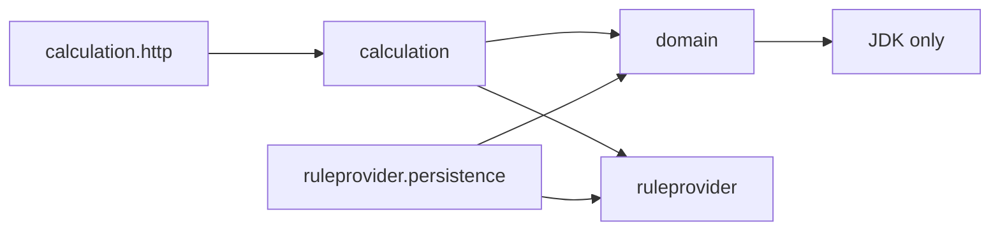
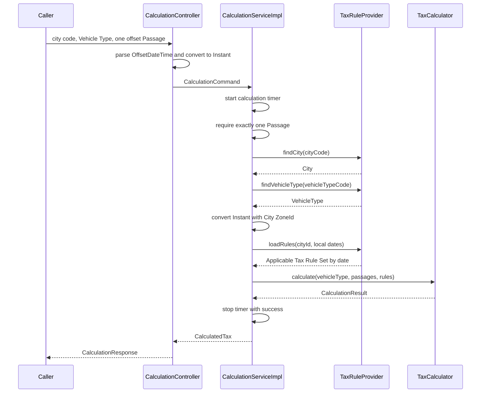
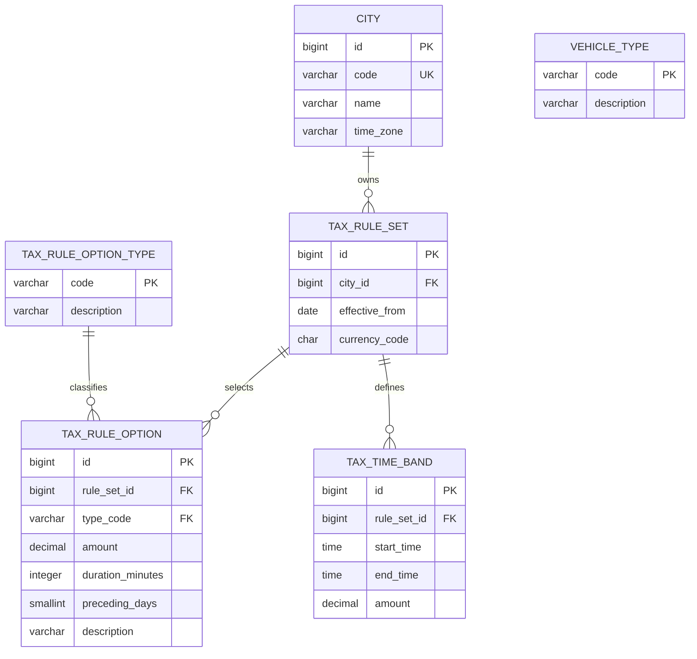

# Issue 3: Calculate One Passage from Stored Tax Rules

## Purpose

This plan defines the first complete Congestion Tax Calculation path for issue 3. It is the executable handoff for the issue branch. Read `CONTEXT.md`, `CONTRIBUTING.md`, the applicable design documents, and ADR 0007 before changing code.

The issue is complete when one HTTP request selects Gothenburg, sends the known `OTHER` Vehicle Type and one offset Passage, loads the Applicable Tax Rule Set from PostgreSQL, returns one Daily Tax, and publishes the calculation latency histogram.

## Fixed Scope

Implement only this vertical slice:

- Accept the final collection-based HTTP shape with exactly one Passage for this issue.
- Convert the Passage instant to City Local Time.
- Select the latest Tax Rule Set whose effective date is not after the calculation date.
- Load one positive Tax Time Band and the absence of optional Tax Rules.
- Calculate separate Passage charges with no Daily Tax maximum.
- Return the final response shape with one Daily Tax.
- Record the Calculation Service timer with a bounded outcome.

Keep these later-ticket boundaries:

- Issue 4 adds multiple Passages, sorting, repeated timestamps, Charge Windows, a Daily Tax maximum, and the Passage-count distribution summary.
- Issue 5 adds complete supported-year validation, several local dates, successive snapshots, future snapshots, and several currencies.
- Issue 6 adds Tax Exemptions, all supplied Vehicle Types, and complete exempt-vehicle behavior.
- Issue 7 adds complete transport validation, Problem Details, centralized exception handling, Bean Validation, and OpenAPI.
- Issue 8 adds all Gothenburg rule content, the 89 SEK scenario, an alternate city, and the final stored-rule failure coverage.

The issue 3 seed is pre-release staged content. It is enough for this slice but is not the complete Gothenburg snapshot. Later Flyway migrations extend this initial snapshot before the application is complete.

## Change Control

Continue without another design decision for private helpers, constraint names, entity constructors, and equivalent repository details that preserve this plan.

Return for a new planning decision before changing:

- Congestion Tax behavior or project language;
- the database schema or public HTTP contract;
- package dependencies or a public Java contract;
- meter names, tags, or outcome meaning;
- an acceptance test or an issue boundary.

## Required Result

Use this canonical request:

```http
POST /api/v1/cities/gothenburg/congestion-tax/calculations
Content-Type: application/json

{
  "vehicleType": "OTHER",
  "passages": ["2013-02-08T05:20:27Z"]
}
```

`2013-02-08T05:20:27Z` is `2013-02-08T06:20:27` in `Europe/Stockholm`. It matches the stored `06:00` through `06:30` band.

Return:

```json
{
  "cityCode": "gothenburg",
  "vehicleType": "OTHER",
  "currency": "SEK",
  "totalAmount": 8.00,
  "dailyTaxes": [
    {
      "date": "2013-02-08",
      "vehicleExempt": false,
      "amount": 8.00
    }
  ]
}
```

## Owned Modules



Use this source layout:

```text
io/github/igrgin/congestiontax
├── calculation
│   ├── CalculatedTax.java
│   ├── CalculationCommand.java
│   ├── CalculationService.java
│   ├── CalculationServiceImpl.java
│   ├── exception
│   │   ├── CalculationRejectedException.java
│   │   ├── InvalidPassageCountException.java
│   │   ├── UnknownCityException.java
│   │   └── UnknownVehicleTypeException.java
│   └── http
│       ├── CalculationController.java
│       └── dto
│           ├── CalculationRequest.java
│           ├── CalculationResponse.java
│           └── DailyTaxResponse.java
├── domain
│   ├── TaxAmount.java
│   ├── VehicleType.java
│   ├── calculation
│   │   ├── CalculationResult.java
│   │   ├── DailyTax.java
│   │   ├── LocalizedPassage.java
│   │   └── TaxCalculator.java
│   └── rule
│       ├── DailyTaxLimit.java
│       ├── PassageAmount.java
│       ├── PassageChargingRule.java
│       ├── TaxRuleSet.java
│       └── TaxTimeBand.java
└── ruleprovider
    ├── City.java
    ├── InvalidStoredRulesException.java
    ├── TaxRuleProvider.java
    └── persistence
        ├── JpaTaxRuleProvider.java
        ├── city
        │   ├── CityEntity.java
        │   └── CityRepository.java
        ├── taxruleoption
        │   ├── TaxRuleOptionEntity.java
        │   ├── TaxRuleOptionRepository.java
        │   └── TaxRuleOptionType.java
        ├── taxruleset
        │   ├── TaxRuleSetEntity.java
        │   └── TaxRuleSetRepository.java
        ├── taxtimeband
        │   ├── TaxTimeBandEntity.java
        │   └── TaxTimeBandRepository.java
        └── vehicletype
            ├── VehicleTypeEntity.java
            └── VehicleTypeRepository.java
```

`domain` owns calculation behavior. It receives a known Vehicle Type, localized Passages, and Applicable Tax Rule Sets. It returns Daily Taxes and a total. It does not own lookup, transport parsing, time-zone conversion, persistence, logging, or metrics.

## Public Java Contracts

### Domain Values

Implement these contracts:

```java
public record TaxAmount(BigDecimal amount, Currency currency) {
    public static TaxAmount zero(Currency currency);
    public TaxAmount add(TaxAmount other);
    public TaxAmount min(TaxAmount other);
}

public record VehicleType(String code, String description) {}

public record LocalizedPassage(
        Instant occurredAt,
        LocalDateTime cityDateTime) {}

public record PassageAmount(
        LocalizedPassage passage,
        TaxAmount amount) {}

public record DailyTax(
        LocalDate date,
        boolean vehicleExempt,
        TaxAmount amount) {}

public record CalculationResult(
        VehicleType vehicleType,
        Currency currency,
        List<DailyTax> dailyTaxes,
        TaxAmount totalAmount) {}
```

Records that receive collections make defensive copies. Text fields are nonblank. Required values are non-null.

`TaxAmount` applies these rules:

- Store the amount at scale 2.
- Use `RoundingMode.UNNECESSARY`; an input that needs rounding is invalid.
- Accept zero and positive amounts.
- Require equal currencies for arithmetic and comparison.
- Preserve the currency in every result.

### Tax Rules

```java
public class TaxTimeBand {
    public TaxTimeBand(LocalTime startTime, LocalTime endTime, TaxAmount amount);
    public LocalTime startTime();
    public LocalTime endTime();
    public TaxAmount amount();
    public boolean includes(LocalTime localTime);
}

public class DailyTaxLimit {
    public static DailyTaxLimit unlimited(Currency currency);
    public static DailyTaxLimit cappedAt(TaxAmount maximumAmount);
    public TaxAmount apply(TaxAmount amount);
}

public interface PassageChargingRule {
    TaxAmount calculate(List<PassageAmount> passageAmounts);

    static PassageChargingRule separateCharges();
}

public record TaxRuleSet(
        LocalDate effectiveFrom,
        Currency currency,
        DailyTaxLimit dailyTaxLimit,
        PassageChargingRule passageChargingRule,
        Set<DayOfWeek> exemptWeekdays,
        Set<Month> exemptMonths,
        Set<LocalDate> publicHolidays,
        int holidayPrecedingDays,
        Set<VehicleType> exemptVehicleTypes,
        List<TaxTimeBand> taxTimeBands) {}
```

`TaxTimeBand` requires a positive amount. Its start is included and its end is excluded. A later end is a same-date band, an earlier end crosses midnight, and equal times cover a complete day. Issue 3 needs the same-date case; keep the contract ready for the other cases.

`TaxRuleSet` makes defensive copies, requires at least one Tax Time Band, and verifies that every Tax Amount uses its currency.

`DailyTaxLimit.unlimited` returns the input after it verifies the currency. `cappedAt` returns the smaller of the input and maximum. `PassageChargingRule.separateCharges` adds every Passage Amount.

### Calculator

```java
public class TaxCalculator {
    public CalculationResult calculate(
            VehicleType vehicleType,
            List<LocalizedPassage> passages,
            Map<LocalDate, TaxRuleSet> applicableRules);
}
```

For issue 3, the calculator:

1. Finds the Applicable Tax Rule Set for the Passage local date.
2. Produces zero if no Tax Time Band includes the local time.
3. Creates one `PassageAmount` for a matching band.
4. Uses the separate-charge rule.
5. Applies the unlimited Daily Tax limit.
6. Returns one `DailyTax` with `vehicleExempt` set to `false` and a matching total.

The provider supplies one valid rule for every required date. It rejects an absent rule date, overlapping bands, or a mixed currency before it calls the calculator.

### Provider

```java
public record City(
        long id,
        String code,
        String name,
        ZoneId timeZone) {}

public interface TaxRuleProvider {
    Optional<City> findCity(String cityCode);
    Optional<VehicleType> findVehicleType(String vehicleTypeCode);
    Map<LocalDate, TaxRuleSet> loadRules(long cityId, Set<LocalDate> requiredDates);
}
```

`City.id` is a positive database identity. Codes and descriptions are nonblank. `City.code` is the stable public city identifier used by the path, provider, and response.

### Application

```java
public record CalculationCommand(
        String cityCode,
        String vehicleTypeCode,
        List<Instant> passageInstants) {}

public interface CalculationService {
    CalculatedTax calculate(CalculationCommand command);
}

public record CalculatedTax(
        String cityCode,
        CalculationResult calculationResult) {}
```

`CalculationCommand` makes a defensive copy. `CalculationServiceImpl` uses an explicit constructor for its dependencies and timer provider.

## Application Sequence



The Calculation Service has no transaction. `JpaTaxRuleProvider.loadRules` owns the read-only transaction.

## Failure Contracts

Use this application exception hierarchy:

```text
CalculationRejectedException
├── InvalidPassageCountException
├── UnknownCityException
└── UnknownVehicleTypeException
```

`CalculationRejectedException` is abstract. The other application exceptions represent expected caller rejections. The controller converts them to `ResponseStatusException` with HTTP 400 for this issue. Complete status and Problem Details behavior belongs to issue 7.

The controller also returns HTTP 400 for a null Passage or a timestamp without `Z` or an explicit offset. Timestamp parsing occurs before the Calculation Service timer.

`InvalidStoredRulesException` belongs to `ruleprovider`. It covers an invalid time zone or currency, no rule for a required date, no Tax Time Bands, overlapping bands, selected options that this slice does not support, and inconsistent currencies. It is a system failure, not a caller rejection. Database exceptions also remain system failures.

## HTTP Adapter

Use this operation:

```java
@PostMapping("/api/v1/cities/{cityCode}/congestion-tax/calculations")
public CalculationResponse calculate(
        @PathVariable String cityCode,
        @RequestBody CalculationRequest request);
```

Use these DTOs:

```java
public record CalculationRequest(
        String vehicleType,
        List<String> passages) {}

public record CalculationResponse(
        String cityCode,
        String vehicleType,
        String currency,
        BigDecimal totalAmount,
        List<DailyTaxResponse> dailyTaxes) {}

public record DailyTaxResponse(
        LocalDate date,
        boolean vehicleExempt,
        BigDecimal amount) {}
```

The request record changes a null passage list to an empty immutable list. The controller requires exactly one non-null string, parses it with `OffsetDateTime`, converts it to `Instant`, and calls the service. The controller maps `Currency` to its three-letter code. Monetary JSON values stay `BigDecimal` values with scale 2.

The temporary exact-one check can exist at the controller and service seams. Keep the service guard because other adapters can call it. Issue 4 removes the upper one-item limit without changing the collection contracts.

## Database Migrations

Create:

```text
src/main/resources/db/migration/
├── V1__create_core_tax_rule_schema.sql
└── V2__seed_one_passage_calculation.sql
```

### Core Schema



Create these columns:

| Table | Columns |
|---|---|
| `city` | `id BIGINT GENERATED BY DEFAULT AS IDENTITY`, `code VARCHAR(64)`, `name VARCHAR(128)`, `time_zone VARCHAR(64)` |
| `vehicle_type` | `code VARCHAR(32)`, `description VARCHAR(128)` |
| `tax_rule_set` | identity `id`, `city_id BIGINT`, `effective_from DATE`, `currency_code CHAR(3)` |
| `tax_rule_option_type` | `code VARCHAR(32)`, `description VARCHAR(128)` |
| `tax_rule_option` | identity `id`, `rule_set_id BIGINT`, `type_code VARCHAR(32)`, `amount NUMERIC(12,2)`, `duration_minutes INTEGER`, `preceding_days SMALLINT`, `description VARCHAR(255)` |
| `tax_time_band` | identity `id`, `rule_set_id BIGINT`, `start_time TIME WITHOUT TIME ZONE`, `end_time TIME WITHOUT TIME ZONE`, `amount NUMERIC(12,2)` |

Required values are `NOT NULL`. Add primary keys, restrictive foreign keys, and these rules:

- city code is unique;
- one city has at most one Tax Rule Set for an effective date;
- one Tax Rule Set has at most one option of each type;
- one Tax Rule Set has at most one band with the same start and end;
- band amounts are positive;
- option scalar values are positive and exactly one value column matches its type.

The option types are `DAILY_MAXIMUM`, `CHARGE_WINDOW`, and `HOLIDAY_PRECEDING`. Their type-specific check requires the other scalar columns to be null. The approved unique constraints supply the leading indexes needed by the issue 3 queries. Add no duplicate indexes.

### Staged Seed

Insert:

- City `gothenburg`, name `Gothenburg`, time zone `Europe/Stockholm`;
- Vehicle Type `OTHER` with a clear description;
- all three Tax Rule Option Type rows;
- one Tax Rule Set effective `2013-01-01` with currency `SEK`;
- no selected Tax Rule Option rows;
- one Tax Time Band from `06:00` through `06:30` with amount `8.00`.

The absent option rows map to unlimited Daily Tax, separate Passage charges, and zero public-holiday preceding days. Seed only `OTHER` in this issue so that a known exempt type cannot appear taxable before issue 6 adds exemptions.

## JPA Adapter

Map `cityId` and `ruleSetId` as scalar fields. PostgreSQL foreign keys enforce relationships. Use no entity association for this read path.

Repository interfaces extend `Repository<T, ID>` and expose only these reads:

- City by code;
- Vehicle Type by code;
- Tax Rule Set candidates for one city with `effectiveFrom` not after the latest required date, ordered by effective date descending;
- Tax Rule Options for a collection of Tax Rule Set IDs;
- Tax Time Bands for a collection of Tax Rule Set IDs.

`JpaTaxRuleProvider.loadRules` uses `@Transactional(readOnly = true)` and performs this work:

1. Load candidate Tax Rule Sets once.
2. Select the latest candidate that applies to each required date.
3. Collect the distinct selected IDs.
4. Bulk-load options and bands for those IDs.
5. Group child rows by scalar Rule Set ID.
6. Validate and map each selected set.
7. Return an unmodifiable map sorted by date.

For this issue, any selected Tax Rule Option row produces `InvalidStoredRulesException`. An empty option collection maps to the approved defaults. Validate `ZoneId` and `Currency` codes while mapping. Validate at least one band, matching currencies, and no band overlap. Translate value-construction failures from stored rows to `InvalidStoredRulesException` with safe context.

Entity classes use field access, a protected no-argument constructor for JPA, and getters only for values the adapter reads. They have no child collections, cascade, setters, or entity equality policy. The research basis is in `docs/research/jpa-scalar-foreign-key-guidance.md`.

Set:

```yaml
spring:
  jpa:
    open-in-view: false
    hibernate:
      ddl-auto: validate
```

Hibernate schema validation does not prove foreign keys or check constraints. PostgreSQL integration tests prove those rules.

## Metrics

Add this common configuration:

```yaml
management:
  metrics:
    distribution:
      percentiles-histogram:
        congestion.tax.calculation: true
```

Instrument `CalculationServiceImpl.calculate` with one timer named `congestion.tax.calculation` and one tag named `outcome`.

Use only these values:

- `success`: the service returns a `CalculatedTax`;
- `rejected`: a `CalculationRejectedException` leaves the service;
- `failed`: any other exception or error leaves the service.

Use `Timer.Sample` and a `Meter.MeterProvider<Timer>` so every timer with this name has the `outcome` tag. Start with `failed`, change the outcome before a successful return or expected rethrow, and stop in `finally`.

Metric collection cannot change a calculation result. Catch metric `RuntimeException` while starting and stopping the timer. Log a warning without request data and preserve the original result or failure. Do not configure client-side percentiles, service-level objective boundaries, or expected timer bounds in this issue.

Prometheus publishes the histogram as `congestion_tax_calculation_seconds_bucket`. A sample must be recorded before the histogram appears in a scrape.

## Test Plan

Write tests in this order and keep each production change small enough to make the next focused test pass.

### 1. Domain Values and Calculator

Create:

- `TaxAmountTest`: scale, non-negative values, same-currency addition and minimum, and mixed-currency rejection.
- `TaxTimeBandTest`: inclusive start, exclusive end, and a time outside the seeded same-date band.
- `TaxCalculatorTest`: one taxed Passage produces 8.00 SEK; a Passage outside a band produces 0.00 SEK; returned collections are immutable.

These tests start no Spring context.

### 2. Calculation Service and Timer

Create `CalculationServiceImplTest` with fakes or Mockito and a new `SimpleMeterRegistry` per test. Cover:

- successful lookup, City Local Time conversion, rule-date request, calculator call, and result;
- unknown city as `rejected`;
- an unexpected provider failure as `failed`.

For each outcome, assert timer count 1. Assert that every timer ID has only the `outcome` tag and that its value is one of `success`, `rejected`, or `failed`. Do not assert elapsed time.

### 3. HTTP Mapping

Create `CalculationControllerTest` as a small controller test. Cover the final successful request and response shape, an empty passage list, and a timestamp without an offset. Keep complete validation and final error JSON for issue 7.

### 4. Flyway Schema

Create `TaxRuleSchemaITest` with PostgreSQL. Prove that Flyway installs the schema and that PostgreSQL rejects:

- a Tax Rule Set with an unknown city;
- a Tax Rule Option with an unknown Tax Rule Set;
- a Tax Rule Option with an unknown option type;
- a Tax Time Band with an unknown Tax Rule Set;
- a non-positive Tax Time Band amount;
- a Tax Rule Option with the wrong scalar columns;
- a duplicate city code;
- a duplicate city and effective-date pair.

### 5. Complete Path

Create `CalculationITest` with the `itest` profile and `@AutoConfigureMetrics`. Send the canonical HTTP request and assert the complete JSON response.

After the request, scrape `/actuator/prometheus`. Assert that at least one `congestion_tax_calculation_seconds_bucket` line has `outcome="success"`. Also assert the matching count family. Do not compare the complete scrape, label order, bucket values, or volatile counts.

Keep `ActuatorITest` unchanged.

### Durable Test Boundary

Keep the empty-list rejection and one-Passage success tests when later issues expand behavior. Do not add a test whose purpose is to require two Passages to fail. The exact-one upper limit is temporary and issue 4 removes it.

## Delivery Sequence

1. Add the value and calculator tests, then implement the JDK-only domain contracts. Completion: all domain tests pass without Spring.
2. Add service orchestration and outcome tests, then implement the provider interface, application service, exceptions, and timer. Completion: all three timer outcomes and City Local Time conversion pass.
3. Add controller tests, then implement DTO parsing and response mapping. Completion: successful, empty, and offset-free requests have the approved behavior.
4. Add schema tests, then create the Flyway schema and staged seed. Completion: the migration runs and every listed PostgreSQL constraint is proved.
5. Add JPA entities, narrow repositories, and `JpaTaxRuleProvider`. Completion: the provider loads the staged Applicable Tax Rule Set through explicit bulk reads.
6. Add the full-path test and configuration. Completion: the canonical request returns 8.00 SEK and the Prometheus histogram contains a success sample.
7. Run Spotless, focused tests, and `./mvnw verify`. Completion: the complete build is green and the work agrees with every issue 3 acceptance criterion.
8. Run the project code-review workflow against the issue branch and correct accepted findings. Completion: both standards and specification reviews have no unresolved actionable finding, and verification passes after the last correction.

## Verification Commands

```text
./mvnw test
./mvnw verify -Dskip.regular.tests=true
./mvnw spotless:apply
./mvnw verify
```

Use focused test selection during development. Run the complete verification after the final review correction.

## Completion Checklist

- The canonical HTTP request returns the approved response.
- PostgreSQL and Flyway supply the City, Vehicle Type, Applicable Tax Rule Set, and Tax Time Band.
- JPA rows do not leave the persistence adapter.
- The pure calculator has JDK dependencies only.
- The Calculation Service timer records `success`, `rejected`, and `failed` through focused tests.
- The Prometheus scrape contains the success histogram after a calculation.
- The package and dependency rules match ADR 0007 and `CONTRIBUTING.md`.
- Focused tests and `./mvnw verify` pass.
- Issue 4 through issue 8 behavior remains outside this branch.
